[TOC]

# 计算系统基础

- 赛博抄书.
- 一些内容使用了LaTeX内联公式, 使用Typora或其他软件查阅即可获得原汁原味的效果.

## 第1章 引言

### 1.2 计算机与计算机系统

#### 计算机

1. 通用计算设备
   - (阿兰·图灵) 所有计算机都可以做相同计算，只是在计算速度上有差别
   - 新的计算形式，只需安装合适的软件，无需新计算机
2. 电子设备
   - 计算最终是通过电子电路中的电流、电位等实现的
3. 数字设备
   - 所有信息都是采用数字化的形式表示
   - 区别于模拟设备: 通过测量物理量 (距离或电压) 计算.
4. *计算机理论模型: 图灵机
   - 思想模型, 对应一个抽象的机器
     - 无限长的纸带 (Tape), 由一个个小方格 (Cell) 组成, 包含有限符号集 (0/1/其他字符)
     - 一个可在纸带上左右移动的机器/读写头 (Head)
     - 一组状态 (State): 机器内部状态, 确定下一动作
     - 转移函数 (Transition Function): 定义了在给定状态和读取头上的符号情况下, 图灵机应采取什么行动 (操作): 写入新符号, 移动读写头 (左或右), 并切换到新状态
   - 过程: 
     1. 从初始状态开始, 读写头位于纸带上的某个位置.
     2. 根据当前状态和读写头所在的单元格上的符号, 图灵机通过转移函数来确定下一步的动作: 读取当前符号, 写入新符号, 移动头的位置, 并切换到新状态.
     3. 图灵机根据转移函数执行相应的操作, 然后进入新的状态.
     4. 步骤2和步骤3重复进行, 直到图灵机进入一个特定的停机状态 (Halt State) 或者永远不停机.
5. 计算机
   - 核心处理部件是CPU (Central Processing Unit, 中央处理器), 其最重要的工作是执行指令
   - 指令说明计算机执行一件明确定义的工作. 
   - 计算机程序: 由一组指令组成. 指令是计算机程序中规定的可执行的最小工作单位.
   - 现代计算机由冯·诺依曼提出的"存储程序控制原理"思想构建. 
     - 核心部件有CPU和存储器 (内存). 
     - CPU负责完成两项工作: 指挥信息的处理 (从存储器/内存 (memory) 里读取下一条指令) 和执行信息的实际处理 (即执行该指令), 这两项工作循环进行.

#### 计算机系统

- 由硬件和软件两部分组成
- 硬件系统: 中央处理器 (运算器, 控制器, 寄存器), 存储器 (內: RAM, ROM, 外: 硬盘), 输入设备, 输出设备
- 软件系统: 系统软件 (操作系统, 数据库系统, 程序设计语言), 应用软件

### 1.3 计算系统

- 计算系统使用电子解决问题的过程可表示为7个抽象层次.
- 抽象层次: 每一层对它的上一层隐藏了自己的技术细节.
- 从顶到底: 问题 > 算法 > 程序 (语言处理 > 操作系统) > 指令集结构 > 微处理器 > 逻辑电路 > 元件
- 本书的目标即解释这个系统.

#### 问题

- 自然语言描述具有"歧义性", 不能直接作为计算机的指令.
- 计算机是电子设备, 只能机械执行明确的指令.

#### 算法

- 将自然语言描述的问题转换成一个无歧义的操作步骤即是算法 (Algorithm).
- 有限性: 程序最终能够结束
- 确定性: 每个步骤都必须是明确的, 不应存在歧义性.
- 有效可计算性: 每个步骤都能被计算机执行

#### 程序

- 使用程序设计语言把算法转换为程序.
- 程序设计语言与自然语言不同, 它是用于表达计算机指令的语言, 不存在歧义性.
- 高级程序设计语言: 编译型, 解释型
- 低级程序设计语言: 汇编语言 (用助记符号书写语言), 机器语言 (用机器码书写指令, 不需要进行语言处理)

#### 语言处理

- 高级语言 -(编译, 高级语言处理)> 汇编语言 -(汇编, 低级语言处理)> 机器语言 -(运行)> 计算机

#### 操作系统

- 最初功能: 包含支持输入/输出 (I/O) 操作的设备管理例程 (本书范围).
- 扩展实现: 文件管理, 内存管理, 进程管理等功能.

#### 指令集结构

- 高级语言程序翻译成机器语言的依据就是目标机器的指令集结构 (Instruction Set Architecture, ISA).
- 是程序和底层计算机硬件之间的接口 (Interface) 的完整定义.
- 规定了操作数, 数据类型, 寻址模式.

#### 微处理器

- 每一种指令集结构都可以采用多种微结构来实现.
- 对于计算机设计者来说, 每一种实现都是一次对微处理器的成本和性能之间的平衡.

#### 逻辑电路

- 组成微处理器的每一个组件的逻辑电路的实现.
- 也需要尽量平衡成本和性能.

#### 元件

- 每一种基本的逻辑电路都由特定的物理元件实现.

### 1.4 本书的结构

- 6~14章: 描述从晶体管到逻辑电路, 到处理器, 到指令集结构, 到程序的转换. (自底向上)
- 15~17章: 将C语言程序和底层的DLX联系起来, 以便理解在C语言程序中使用某一种结构时, 在底层的计算机是如何实现的.

## 第6章 数据的机器级表示

### 6.1 位和数据类型

#### 信息的最小单位-位

- 0和1被称为比特 (bit), 或位
- 字长: 计算机CPU (ALU) 一次能并行处理的二进制位数通常被称为计算机的字长 (word length), 每一个元素被称为一个字 (word).

#### 数据类型

- 在计算机上能对以某种表示法编码的信息进行运算, 这种特殊的表示法就被称为数据类型.
- **大端法和小端法**: 两种不同的字节序 (Byte Order) 的表示方式, 用于确定多字节数据存储时哪个字节位于起始位置
  - 大端法 (Big Endian, BE): 最高有效字节位于最低的内存地址, 最低有效字节位于最高的内存地址
  - 小端法 (Little Endian, LE): 最低有效字节位于最低的内存地址, 最高有效字节位于最高的内存地址

### 6.2 整数数据类型

#### 无符号整数

- 使用$k$位数, 就可以表示从$0$到$2^k-1$共$2^k$个整数

#### 有符号整数

- 正数: 按照位置计数法直接表示, 有$k$位就用$2^k$个码字的一半来表示从$0$到$2^k-1$的正数. $0$和所有正数都是以$0$开头的
- 负数
  - 原码: 将一个正数的最高位设为1表示其对应的负数
  - 反码: 对正数"按位取反"来表示其对应的负数
  - 补码: 符合硬件需求

### 6.3 二进制补码正数

- 几乎所有计算机使用相同的基本结构进行加法运算, 称为算术逻辑单元 (Arithmetic and Logic Unit, ALU)
- $-A$的表示可以通过把$A$的反码加1得到, 即"取反加一".

### 6.4 二进制-十进制转换

- 二进制到十进制的转换
  - 若最高位为1, 先得到与其绝对值相同的正数的二进制补码表示 (即"取反加一")
- 十进制到二进制的转换
  - 对十进制数$N$"除2取余", 将余数从高位向低位依次排列 (即最后得到的余数放在最高位), 得到$N$的绝对值的二进制表示
  - 如果$N$为正, 则在前面补0. 如果为负, 则先补0, 再计算出这个补码二进制数的负数 (即"取反加一").

### 6.5 算术运算

#### 加法和减法

- 二进制补码的算术运算与十进制运算十分相似

#### 符号扩展

- 对两个具有不同长度的数值做加法, 首先必须将它们表示为相同的长度
- 用0来扩展一个正数的左端, 它的值不会改变; 用1来扩展一个负数的左端, 它的值也不会改变.
- 在这两种情况中扩展的都是符号位, 这种运算被称为符号扩展 (Sign-Extension, SEXT)

#### 溢出

- 只有两个符号相同的数相加才有可能会导致溢出, 正数和负数相加永远不会出现溢出.

### 6.6 逻辑运算

#### 基本运算

- 与函数 (AND): 被看作ALL运算
- 或函数 (OR): 被看作ANY运算
- 非函数 (NOT): 一元函数, 只作用于一个操作数
- 其他任何逻辑函数都可以写成以上三种基本逻辑运算符的逻辑组合
- 异或函数 (XOR): 相异为$1$, 相同为$0$
- 同或函数 (XNOR): 相异为$0$, 相同为$1$

#### 布尔代数

- 基本运算符: 与 (·), 或 (+), 非 (-)
- 定律: 分配律, 结合律
  - 吸收律: $A+A·B=A$， $A·(A+B)=A$
  - 德摩根定律: $-(A·B·C)=(-A)+(-B)+(-C)$, $-(A+B+C)=(-A)·(-B)·(-C)$
  - 其他: $A+(-A)·B=A+B$, $A·((-A)+B)=A·B$

### 6.7 其他表示法

#### ASCII

- 美国信息交换标准代码
- 0 -> D48, H30
- A -> D65, H41
- a -> D97, H61

#### 浮点数类型

- 十进制转二进制:

  1. 整数部分, 采用除2取余法
  2. 小数部分, 采用乘2取整法

    - 比如$(0.6875)_{10} = (0.1011)_2$

- 单精度浮点数 (float) 类型 (32位)

  - [31]位表示符号$S$ (正或负), [30:23]位 (共8位) 表示范围$exponent$ (指数域), [22:0]表示 (共23位) 表示精度$fraction$ (分数域)
  - $V_{float}=
        \left\{
        \begin{aligned}
            (-1)^s \times 1.f \times 2^{e-127}, \ 1 \leq e \leq 254  \\
            (-1)^s \times 0.f \times 2^{-126} \ e = 0 \\
            (-1)^s \times 1.f \times 2^{128} = Infinity(+and-), \ e = 255,f = 0\\
            NaN(Not \ a  \ Number), \ e = 255, f \neq 0
        \end{aligned}
        \right.$
  - 第一部分是符号位$S$: 0代表正数, 1代表负数
  - 第二部分是指数部分: 采用8位二进制无符号整数. 对于其指数域內的254个值 (1~254) 解释如下: 实际上被表示的指数是该无符号整数减去127后得到的数值
  - 第三部分是分数部分. 当$exponent$在区间1~254时, 分数是规格化的, 只有唯一一位非0的二进制数出现在二进制小数点的左端, 为1, 因此实际表示的是24位的精度.
    - 当$exponent$为`0000 0000​`时, 指数是-126, 得到的有效数字以0为开头
    - 当$exponent$为`1111 1111`, 如果分数域全为0, 则表示正/负无穷, 如果分数域不全为0, 则该数表示"非数值"

- 双精度浮点数 (double) 类型 (64位)

  - 符号位1位[63], 指数11位[62:52], 分数52位[52:0]
  - $V_{double}=
        \left\{
        \begin{aligned}
            (-1)^s \times 1.f \times 2^{e-1023}, \ 1 \leq e \leq 2046  \\
            (-1)^s \times 0.f \times 2^{-1022} \ e = 0 \\
            (-1)^s \times 1.f \times 2^{1024} = Infinity(+and-), \ e = 2047,f = 0\\
            NaN(Not \ a  \ Number), \ e = 2047, f \neq 0
        \end{aligned}
        \right.$

- 浮点数加减运算: 

  1. 转为二进制规格化小数  
  2. 对指数操作: 小阶向大阶看齐, 使指数相等  
  3. 尾数运算:  
     - 符号位+二进制数补码 (含隐藏位) 运算
  4. 结果规格化: 
     - 尾数相加有进位 (符号位判断溢出规则), 阶码加1
     - 尾数相减, 隐藏位有错位 (即隐藏位变成0)
  5. 舍入操作: 对丢失的位进行舍入处理
     - IEEE浮点舍入方式: 就近/向正无穷/向负无穷/向零舍入
     - 就近舍入 (单精度):
       - 超出23位的多余位大于等于10···01, 尾数最低有效位加1
       - 小于01···11, 直接舍去
       - 等于10···00, 尾数最低有效位为0, 直接舍去, 为1则再加1
  6. 判断指数/阶码是否溢出: 向上/向下溢出
  7. 运算规则: 加法不具备结合性, 乘法不具备结合性, 乘法在加法上不具备结合性

  

#### 十六进制表示法

- 将每4位二进制转换为1位十六进制

#### 八进制表示法

- 将每3位二进制转换为1位八进制

### 6.8 C语言中的数据类型

- ~~(没啥好写的)~~

## 第7章 数字逻辑电路

### 7.0 补充

#### 集成电路

- 采用一定工艺, 把一个电路中所需的晶体管, 二极管, 电阻, 电容和电感等元件及布线互连一起, 制作在一/几小块 半导体 (硅) 晶片/介质基片上, 封装在一个管壳内, 使其具有所需电路功能.
- 特点: 小体积, 低功耗, 高可靠

#### 摩尔定律

- 集成电路上的元器件集成度每隔18~24个月便会增加一倍, 成本保持不变

### 7.1 晶体管

- 微处理器 (计算机的核心) 是由MOS晶体管组成的, MOS晶体管有N型和P型, 在逻辑上起开关的作用.
- N型MOS晶体管有3个终端, 控制端称为栅极 (Gate), 接地一端称为源极(Source), 源极电压记作$V_{SS}$, 接正电压一端称为漏极 (Drain), 漏极电压记作$V_{DD}$, 其源极不能接电源正极.
- 如果N型MOS晶体管的栅极被施加3.3V电压, 源极到漏极间相当于一段电线, 即存在闭合回路, 导通. 如果被加上0V电压, 则断路.
- P型MOS晶体管作用与N型互补, 其源极不能接地, 当其被施加0V电压时电路导通. (多一个小圆圈)
- 既包含P型又包含N型MOS晶体管的电路称为CMOS电路

### 7.2 门电路

- 只使用MOS晶体管就可以构建最基本的门电路, 即实现与, 或, 非逻辑运算的晶体管电路, 相应的电路称为与门, 或门, 非门.

#### 非门 (反相器)

- 由1个P型MOS晶体管和1个N型MOS晶体管组成
- 标准符号 (形状特征型符号): 图7.4 (e)
- 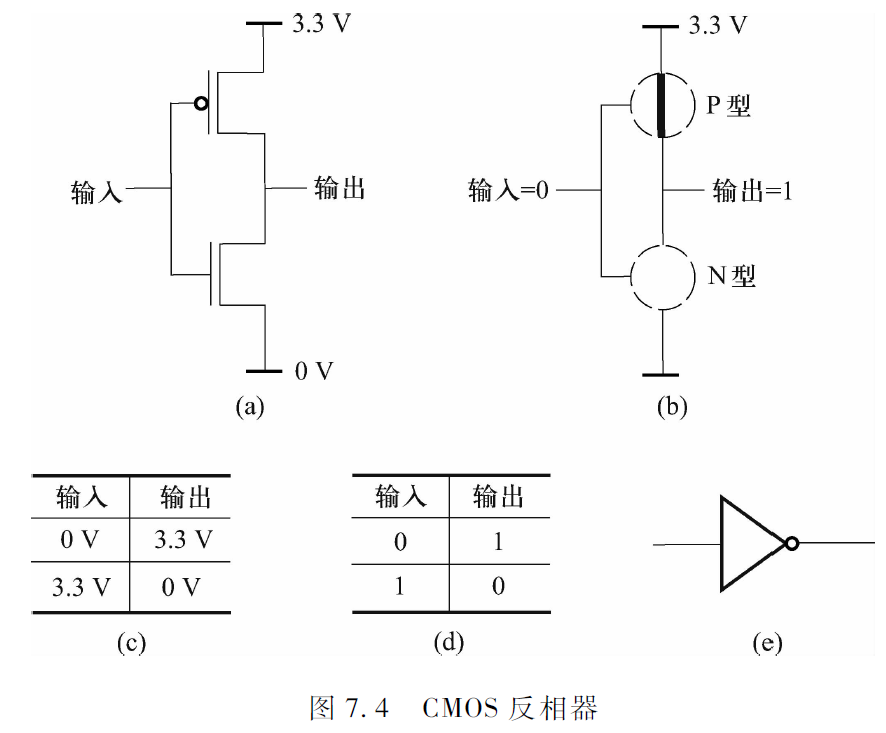
- 矩形国标符号:  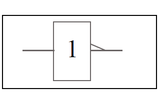

#### 或门, 或非门

- 或非门由2个P型MOS晶体管和2个N型MOS晶体管组成
- 标准符号 (矩形国标符号): 图7.5 (e)
- 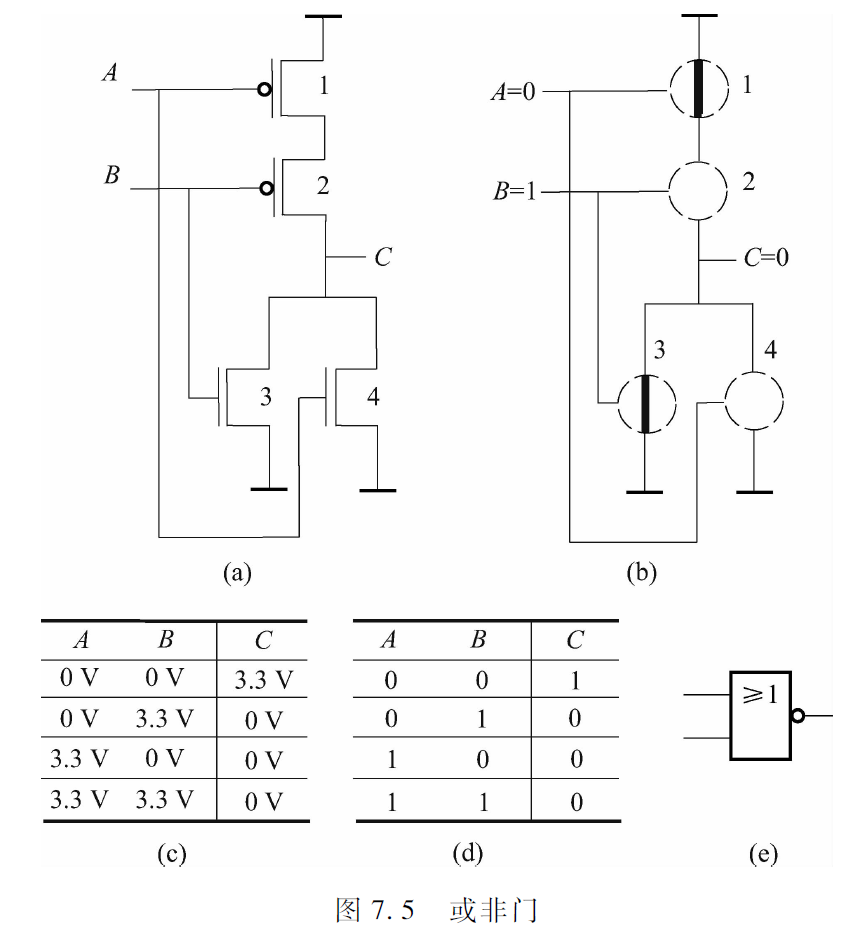
- 或门: 即或非门加上一个反相器
- 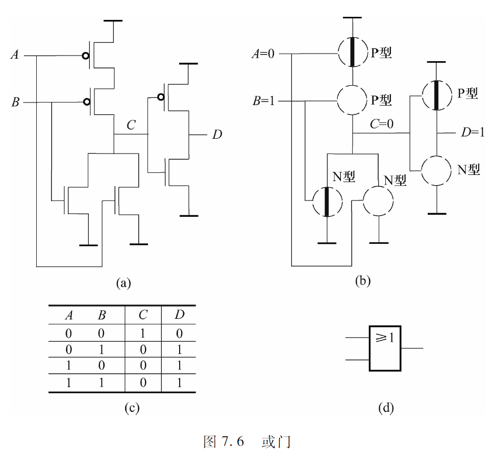

#### 与门, 与非门

- 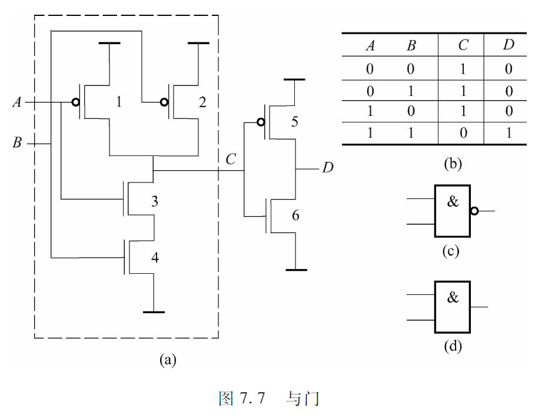

### 7.3 组合逻辑电路

- 逻辑结构可分为两种基本类型: 能够存储信息, 不能存储信息
- 不能存储信息的逻辑结构被称为"判定元件", 通常将它们称为组合逻辑结构.
- 它们的输出仅由当前输入值的组合决定, 不由任何过去存储在其中的信息所决定, 因为信息不能被存储在组合逻辑电路中.

#### 译码器

- 用来判断某个位组合, 如存储器中使用译码器来识别存储单元的地址
- 译码: 将特定含义的二进制码转换成输出信号, 是编码的逆过程
- 有$n$个输入, $2^n$个输出. 只有一个输出为1, 其他全为0. 即被检测的输入组合的输出线被设置为1, 所有其他的输出为0. (这是高电平有效, 低电平有效则相反)

#### 多路选择器

- 用来从多个输入中选择一个输入连接到输出. 选择信号S决定由哪个输出连接到输出.
- 一个多路选择器由$n$条选择线和$2^n$个输入组成.

#### 全加法电路

- 容易理解的版本: 先作出真值表, 只考虑与门输出为1的组合, 把它们用或门串联
- 图7.13 (c)表示一个能进行两个4位二进制加法运算的逻辑电路图, 第$i$列的进位时第$i+1$列进行加法运算的一个输入
- 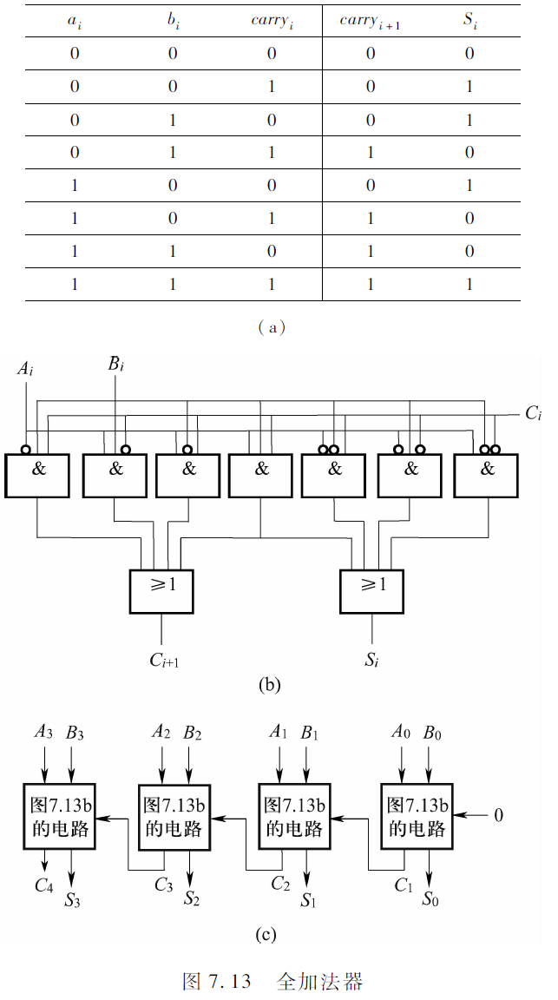

#### 可编程逻辑阵列 (PLA)

- 由一组与门 (与阵列) 和一组或门 (或阵列) 组成.
- 与门的数目对应于真值表中输入组合 (行) 的数目, 对于有$n$个输入的逻辑函数, PLA包含$2^n$个与门, 每个与门有$n$个输入, 将相应的与门的输出和或门的输入相连就可以实现真值表.

#### 逻辑完备性

- 任意逻辑函数都可以通过一个PLA来实现.
- 借助一些布尔代数定律和德摩根定律, 有时可以减少门的数目.

### 7.4 基本存储元件

#### R-S锁存器

- 由两个二输入的与非门组成, 其中任意一个的输出都是另外一个的输入, 其余的输入R和S通常被赋以逻辑值1
- R和S保持为1, 该电路的状态就不会变, 因此称R-S锁存器存储了一个值
- 可以保持R的值为1并将S的值瞬间设为0, 从而把a的值设为1; 同理, 可以保持S的值为1并将R的值瞬间设为0, 从而把a的值设为0 (也叫清空).
- 不能将R和S的值同时设为0, 否则这个锁的最后状态将取决于组成门的晶体管的电子特性而不是取决于被操作的逻辑值.
- 也可以用或非门实现, S和R的设置与上面相反
- 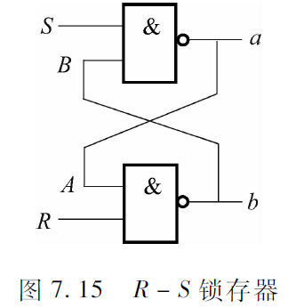

#### 门控D锁存器

- 对R-S锁存器何时设为1, 何时清空进行控制
- 对R-S锁存器增加两个额外的门
- 仅当WE (Write Enable) 被设置为1时才能被设为输入D的值
- 保证了S和R不同时为0
- 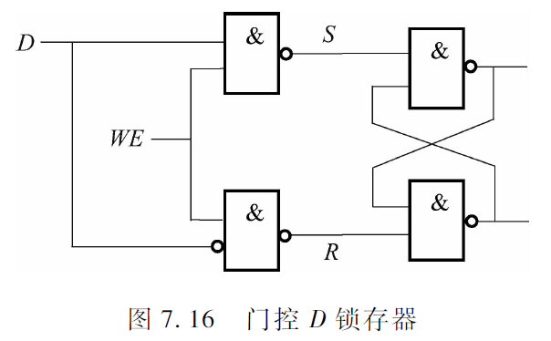

#### 主从D触发器

- [主从触发器](####主从触发器)

#### 锁存器和触发器

- 共同点: 都具有存储功能, 都是时序逻辑电路的基本逻辑单元
- 锁存器: 对脉冲电平 (0/1) 敏感的存储电路, 输入变输出立刻变. 当输入信号不稳定, 输出会出现毛刺. 消耗的门资源相对较少.
- 触发器: 对脉冲边沿 (上升/下降沿) 敏感的存储电路, 状态只在时钟上升沿或下降沿到来的瞬间改变. 不易产生毛刺. 消耗的门资源相对于锁存器多.

#### 寄存器

- 门控D锁存器只能实现一位的存储
- 寄存器 (Register) 就是将多位数据存储到一个独立单元中的结构, 把多位数据捆绑成一个单元. 寄存器可以根据需要包含1位或多位数.
- 编号顺序自右向左, 最右边的为[0].

### 7.5 存储器

#### 地址空间

- 可唯一标识的单元总数称为存储器的地址空间
- 使用$n$位地址能够唯一标识出$2^n$个单元

#### 寻址能力

- 存储在每个单元中的位数是存储器的寻址能力
- 大多数存储器的字节是可寻址的

#### 样例: 一个4x2位的存储器

- 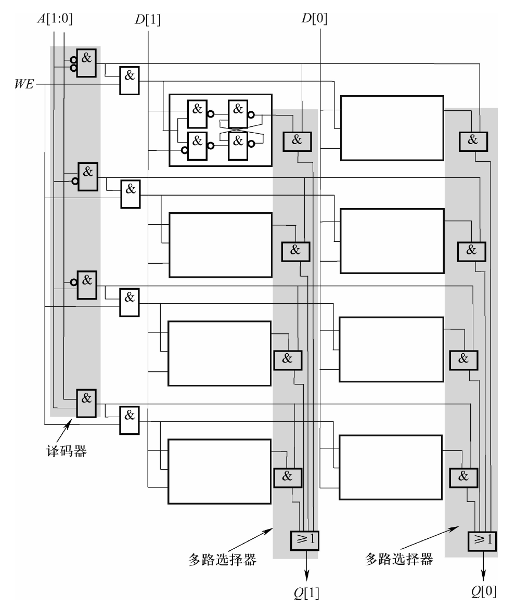
- SRAM (Stati Random Access Memory, 静态随机访问存储器), 只要给它供电, 其内部数据就不会丢失, 可以一直保存, "静态"由此得名.
- 读取单元2: WE设为0, 地址A设为[1:0]=10被译码, 相应的字线被设为1. 存储器的每一位都与其字线进入与门, 然后将其输出与其他字的相应位进入或门, 这在效果上相当于一个多路选择器, 译码器的输出为每一位提供了选择功能, 使得相应的字被读出来.
- 写入单元2: 寻址与读取相似, 但WE被设为1, 与译码器的结果做与运算, 将D中的值[1:0]写入单元2.

### 7.6 时序逻辑电路

- 既能处理信息 (即判定) 也能存储信息的数字逻辑电路.
- 可以用来实现**有限状态机**的机制.
- 位于计算机核心的就是有限状态机控制器.

#### 状态的概念

- 一个系统的状态, 是在某一特定时刻, 系统内所有相关部分的一个瞬态图.

#### 有限状态机

- 存储元件 (寄存器) 的容量是有限的, 所以状态的数目是有限的
- 有限状态机由5个元素组成: 有限数目的状态, 有限数目的外部输入, 有限数目的外部输出, 明确定义的状态转换函数, 明确定义的外部输出函数.
  1. 状态图: 有限状态机可以用状态图表示出来
  2. 时钟: 触发状态从一个向下一个转换的机制是时钟电路, 通常称为时钟, 其信号值在0和1之间交替. 
  3. 在实现有限状态机的电路中, 从一个状态向另一个状态的转换发生在每一个时钟周期的开始.

#### 样例: 交通灯控制器

- 电路分析

  - 1个外部输入, 表示行人按下按钮的行为;
  - 4个外部输出, 用于控制4个灯是否亮
  - 2个内部存储元件, 用来记录控制器处于哪一个状态 (有3种状态, 使用2位就可以唯一标识)
  - 周期为0.5分钟的时钟信号
  - 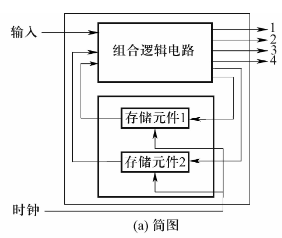

- 组合逻辑

  - 需要两组输出: 一组用于控制灯的亮灭, 一组用于判断存储元件的输入 (即给出下一个状态)
  - 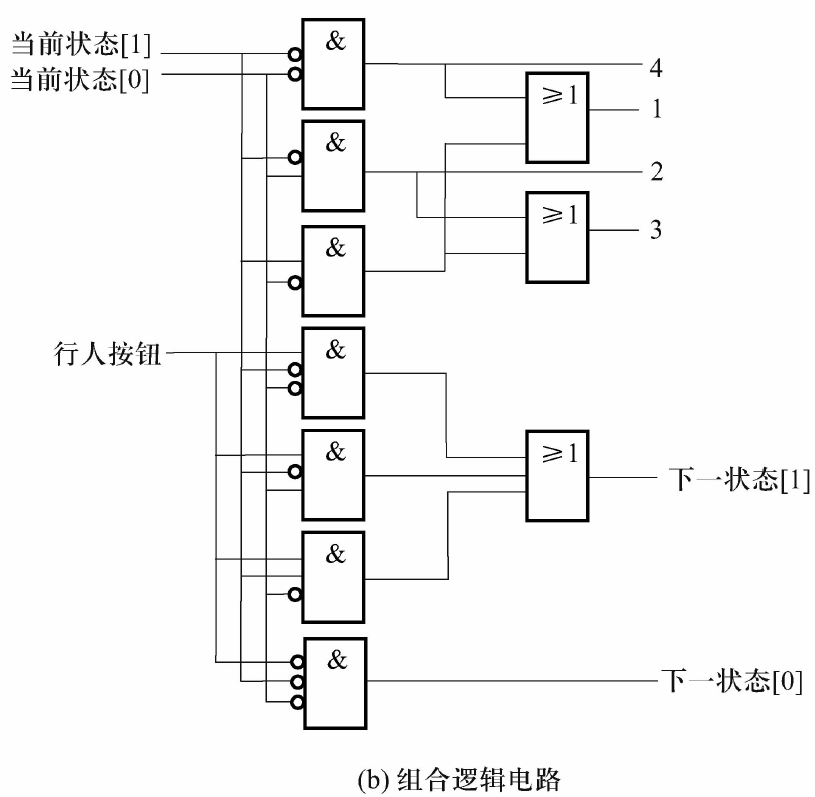

- 存储元件

  - 不能使用门控D锁存器, 原因是在当前的时钟周期里, 存储元件的输出是穿组合逻辑电路的内部输入, 组合逻辑电路的内部输出则成为了存储元件的新的输入, 该输入应该在下一时钟周期发生作用. 使用门控D锁存器, 输入会立即发生作用改写存储元件中的值而不是等到下一周期开始再改写.
  - 应该使用**主从触发器**
  - 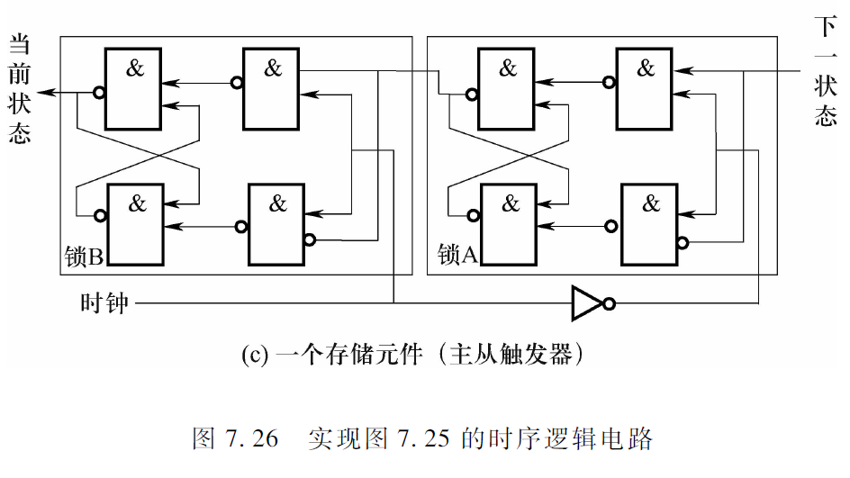

#### 主从触发器

- A为主锁存器, B为锁存器, 使能信号 (WE) 相反
- 实现存储数据和输入信号之间的隔离
- 时钟周期前半段时钟信号为1, A锁中的值不可能被改变, 并且B锁的值与A锁保持一致, 成为组合逻辑电路的内部输入.
- 时钟周期后半段时钟信号为0, B锁的值不可能被改变, 由组合逻辑产生的下一状态改变了A锁中的值, 为下一周期改变B锁的值做好准备.
- 时钟信号由0变1的瞬间, A之前锁存的值保持不变, B锁的输出改变为A中锁存的值.

### 7.7 DLX子集的数据通路

- 数据通路是指再计算机内部用于处理信息的所有元件的总和.

## 第8章 冯·诺依曼模型

- 运用判定元件和存储元件来构建冯·诺依曼结构计算机

### 8.1 基本组件

- 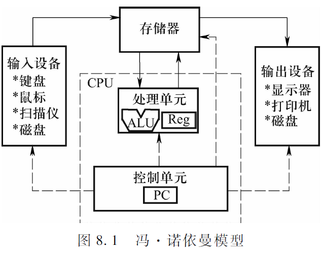
- 处理单元和控制单元是**CPU**的主要组成部分
- 由指令组成的**程序**和程序所需的**数据**位于**存储器**中
- 指令的**执行**由运算器**处理单元**完成
- 指令执行的**顺序**由**控制单元**来控制
- **输入设备**将程序和所需的数据送入计算机
- **输出设备**将执行结果出计算机之外

#### 存储器

- 由基本存储元件构成 (锁存器, 触发器)
- 寄存器: 存储多位信息
- 内存/主存储器 (Memory)
  - 是存储信息的二维阵列, $2^n$行, 每行$m$位. 
  - 每一行是一个存储单元 (Memory Location), 包含一定大小的内容 (指令和数据).
- 地址: 和每一个单元联系在一起的唯一的标识符
- 地址空间: 唯一可识别的单元总数
- 寻址能力: 存储在每个单元的位数
- *SRAM
  - 静态随机访问存储器 (Static Random Access Memory)
  - 结构相对简单
  - “静态”: 只要给它供电，其内部数据就可以一直保存
  - “随机访问”: 可以以任意顺序访问, 而不必关心前一次访问的是哪一个单元
  - 存储元: 可以用更少的晶体管实现
- *DRAM
  - 动态随机访问存储器
  - “动态” : 使用电容存储电荷保存数据
    - 必须隔一段时间刷新 (refresh) 一次
    - 如果存储单元没有被刷新, 存储的信息就会丢失
    - 关机也会丢失数据
  - “随机访问” : 可以以任意顺序访问，而不必关心前一次访问的是哪一个单元
  - 存储元: 采用动态存储单元, 最常见的系统内存

#### 处理单元

- 基本的冯·诺依曼模型处理单元只包含最简单的单元ALU (Arithmetic and Logic Unit, 算术和逻辑单元)
- 字和字长: DLX的字长为32位.
- 寄存器堆/文件Reg: 用于临时存取一些不久就会在计算中使用的数据数据.
  - 每个寄存器都包含一个字.
  - DLX有32个寄存器.

#### 控制单元

- 处理单元负责"执行信息的实际处理", 而控制单元则"指挥信息的处理"
- 具体工作:
  - 在执行程序的过程中，**跟踪**存储器中的指令
  - 在处理指令的过程中，**跟踪**指令的处理阶段
- 跟踪存储器中的指令, 即跟踪要处理的下一条指令. 控制单元有一个用来容纳下一条指令所在地址的寄存器, 即**程序计数器** (Program Counter, PC), 也叫"指令指针", 即寄存器的内容在某种意义上指向要运行的下一条指令.
- 控制单元可以是多个控制器: 如ALU控制器用于控制ALU执行何种运算, 对于输入和输出则有专门的I/O控制器.

#### 输入/输出设备

- 要使计算机处理信息, 信息必须被送入计算机.
- 为了能够使用处理后的结果, 它必须能以某种形式显示在计算机以外.
- 为输入和输出的目的而出现的设备在计算机术语中被称为外围设备 (peripherals).

### 8.2 DLX-冯·诺依曼模型示例

- 对计算机基本组件的再解释
  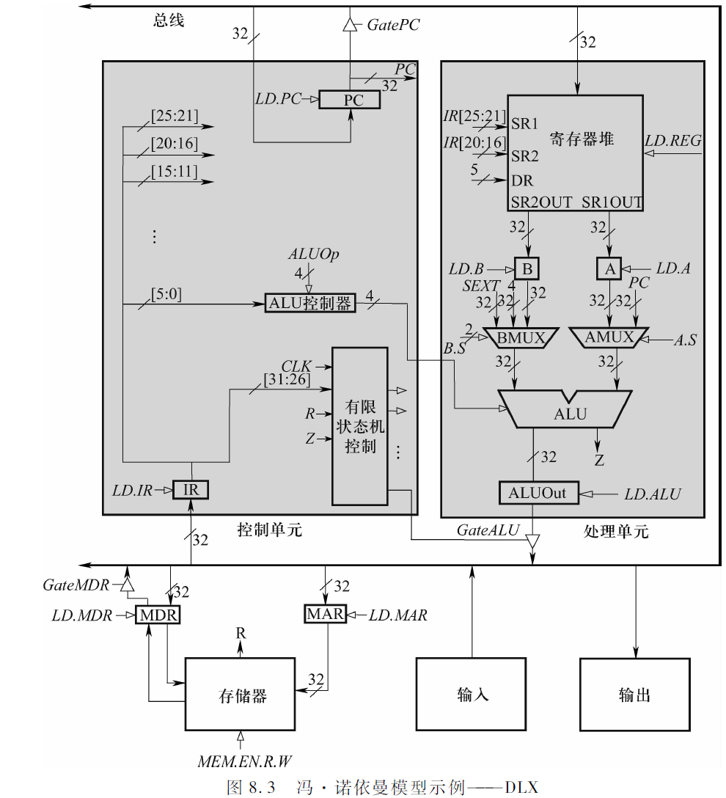
- DLX数据通路
  - 一个采用**总线结构**、**多时钟周期**的实现方案
  - "数据通路": 计算机内部用于处理信息的所有元件的总和
  - 各种寄存器: 寄存器堆/文件, 程序计数器PC, 指令寄存器IR
  - 多路选择器
    - DRMUX提供一个5位的地址给寄存器堆
    - AMUX和BMUX分别提供一个32位的数值给ALU
  - 每根用交叉斜线标记32的线表示该线内共有32条线, 每条用来传送1位的信息
- DLX总线
  - 两端都有箭头的粗黑线结构代表数据通路的总线
  - 优点: 功能多, 成本低; 缺点: 性能和带宽对计算机性能有重要影晌.
  - 在总线上一次只可传输一个值, 每一个提供数据给总线的组件在它的输入箭头后都有一个三角形 (称为三态设备), 使计算机的控制逻辑一次只允许一个提供者能提供信息给总线
  - 从总线获得数据的组件通过将LD. x  (加载使能) 信号设为1, 从而得到信息.
- 存储器
  - 主存地址寄存器 (Memory Address Register, MAR)
    - 保存数据传输**目的位置**或者数据**来源位置**的**地址**
    - 32位, 反映了DLX的存储器的地址空间是$2^{32}$个存储单元
  - 主存数据寄存器 (Memory Data Register, MDR)
    - 保存要**被写入**地址单元或者从地址单元读入的**数据**
    - 32位
    - 在大多数情况下, MDR包含从MAR中的地址开始的**4个连续单元**的**数据**. 有时包含的是MAR所指的单元中的数据 (8位) 符号扩展的结果 (32位).
  - 如果要读出某个存储单元中的内容, 首先把它的地址存入地址寄存入 (MAR), 然后查询存储器, 该地址所对应的存储单元的内容将会输出到数据寄存器 (MDR).
  - 如果要写一个值到存储单元中，首先要把目的地址存入MAR, 把值存入MDR中, 然后设"写使能"信号为1, 查询存储器, MDR里的信息就会被写到MAR中的地址所对应的存储单元里.
- 处理单元
  - 包括一个能进行算术和逻辑运算的功能单元ALU和寄存器堆.
  - 图8.3给出的是DLX子集的数据通路, 未包括整数乘法, 除法及浮点数运算等操作, 也未包括浮点寄存器.
- 控制单元
  - 包括所有用来管理计算机信息处理的组件. 最重要是有限状态机, 负责指挥所有行为.
  - 指令被一个时钟周期一个时钟周期地执行.
  - 有限状态机的一个输入是CLK, 它说明了每个时钟周期持续的时间.
  - 程序计数器 (PC) 记录了下一条要被执行的指令所在的地址.
  - 指令寄存器 (Instruction Register, IR) 用来保存正在处理的指令, IR也是有限状态机的一个输入.
  - 实心箭头表示沿着相应通路流动的是**数据元素**
  - 空心箭头表示控制数据元素处理的**控制信号**, 有限状态机的所有输出都是空心箭头, 如
    - LD.IR (1位), 控制了当前时钟周期内, 指令寄存器 (IR) 是否要从总线上加载新的指令.
    - GateALU, 决定ALUOut的值在当前时钟周期内是否被提供给总线.
- 输入/输出设备: 见第12章

### 8.3 指令处理

- (这一部分在第9章再展开)

#### 指令

#### 多周期实现方案

#### 改变执行方案

### 8.4 DLX的有限状态机

- 一条指令的执行可能包含3~5个阶段, 每一个阶段还由一些步骤组成, 而每一个阶段的每一步都是由控制单元的有限状态机控制的.
- 每条指令的执行都是以返回到状态1结束, 有限状态机可一个周期接一个周期地控制整个计算机程序的执行.
- 停止时钟就可以停止指令的执行.
- 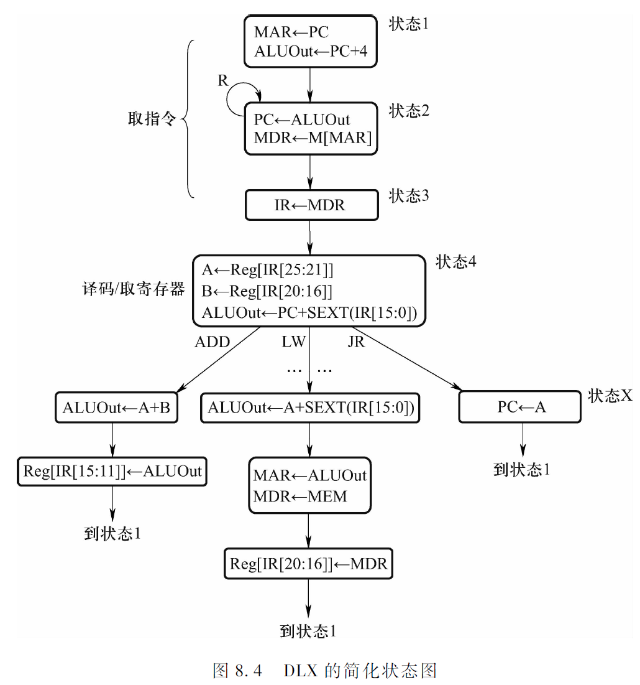

#### 时钟

- 包含一个时钟发生器和一个运行锁.
- 时钟发生器是一个石英晶体振荡器, 能产生震荡电压
- 将运行锁清0就可以停止指令运行.
- 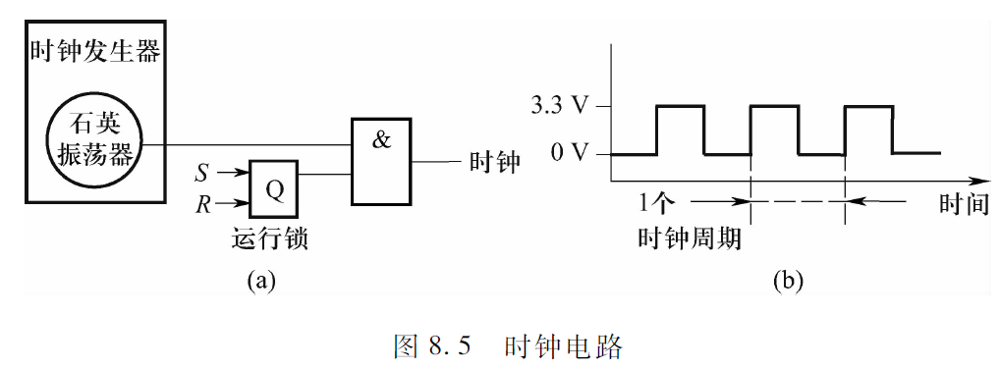

## 第9章 指令集结构

- 指令集结构 (ISA) 是软件指令和执行命令的硬件之间的接口。

### 9.1 指令集结构概述

- 指令集结构指明了再一台机器上编写软件时要注意的全部信息, 换句话说, ISA规定了程序员使用机器语言编程时的全部信息.
- ISA规定了存储器的组织, 寄存器集和指令集, 包括操作码, 数据类型和寻址模式.

#### 存储器组织

- DLX的存储器有$2^{32}$个地址空间的单元, 8位的寻址能力, 但不是所欲地址都用作存储单元.
- DLX通常处理的数据单元都是8比特大小, 8比特又称为一个字节, 因此DLX是可寻址的.
- DLX使用高位优先 (大端法) 的方式, 将字的高位字节放在内存的低地址端, 低位字节放在高地址端.
- DLX规定字的起始地址必须是4的倍速, 即**边界对齐**.

#### 寄存器

- 在一个时钟周期內访问数据的附加临时存储空间
- 最常用的是DLX所采用的通用寄存器集, 其中的寄存器都被称为通用寄存器 (GPR), 共有32个寄存器R0, R1···R31, 每一个寄存器的位数通常是一个字. R0寄存器中的数据必须为0.
- DLX还有32个浮点寄存器, 用于单精度或双精度计算, 共32个, 用F0, F1···,F31表示， 每个32位, 单精度数只需一个浮点寄存器, 双精度数需要两个.

#### 指令集

- 一条指令由操作码 (指令让计算机做的事情) 和操作数 (计算机操作的对象) 组成.
- ISA指令集是由一组操作码, 数据类型和寻址模式定义的. 寻址模式决定了如何计算将要读取/存储的存储单元的地址.
  - CISC (Complex Instruction Set Computer, 复杂指令集计算机), 是功能强大的复杂指令, 开发程序比较容易, 但是由于指令复杂, 指令执行效率较低. 例如Intel的x86指令集.
  - RISC (Reduced Instruction Set Computer, 精简指令集计算机), 指令集较小, 指令执行效率比CISC高, 但是在开发程序方面则有所欠缺. 例如MIPS, SUN的SPARC, IBM的PowerPC. 
  - DLX也是RISC的例子, 有三种类型: I-类型, R-类型, J-类型.

#### 操作码

- DLX ISA的操作码是由指令的[31:26]位定义的, 当其全为0时, 表示指令为R-类型指令, 指令的[5:0]位定义了函数. 非0时指令为I-类型和J-类型.
- 只定义了91条指令, 未被定义的被保留下来
- 指令按照功能可分为4种不同类型, 分别是算术/逻辑运算, 数据传送, 控制和浮点.

#### 数据类型

- 如果ISA的操作码能对以某种表示法编码的信息进行运算, 这种表示法就称为数据类型.
- 如果ISA中有一个操作码能对某种数据类型表示的信息进行运算, 就称该ISA支持这种数据类型.

#### 寻址模式

- 是一种计算将要读取/存储的存储单元的地址的机制.
- DLX只支持一种寻址模式: 基址+偏移量.

### 9.2 算术/逻辑运算指令

- 无论是R-类型还是I-类型, 运算指令的第一个源操作数 (SR1) 都来自于指令[25:21]所标识的寄存器

#### I-类型运算指令

- 第二个源操作数来自于将指令[15:0]进行符号扩展得到的32位整数, 即**立即数**. (Imm16)
- 而目标操作数 (DR) 则来自于指令[20:16]所标识的寄存器.
- `ADDI`-加, `SUBI`-减, `ANDI`-与, `ORI`-或,` XORI`-异或, `SLEI`-是否小于等于, 是返回1, 否返回0, `SLTI`-是否小于, `SEQI`-是否相等, `SRAI`-算术右移立即数 (如果是负数则左边补1), `SRLI`-逻辑右移立即数 (无论正负左边补0), `SLLI`-左移立即数, `LHI`-将立即数左移16位加载到目标操作数中.

#### R-类型运算指令

- 第二个源操作数来自于指令[20:16]所标识的寄存器.
- 目标操作数来自于指令[15:11]所标识的寄存器.
- 除LHI指令外, 其他运算指令均有I-类型和R类型指令, 其解释均与之类似.

### 9.3 数据传送指令

- 本章仅讨论存储器和通用寄存器之间数据的传输.
- 加载 (Ioad): 将数据从存储器移动到寄存器的过程
- 存储 (store): 将数据从寄存器移动到存储器的过程
- `LB`和`SB`指令分别表示加载和存储一个8位的字节, 只需在一个存储单元和一个寄存器之前传送数据.
  `LW`和`SW`指令分别表示加载和存储一个32位的字, 需要在4个连续的存储单元和一个寄存器之间传送数据.
- 均采用I-类型的格式. 需要两个操作数: 一个源操作数SR1[25:21], 一个目标操作数DR[20:16]
- 如果是加载指令, DR寄存器将在从存储器读取数据之后包含该数值. 
  如果是存储指令, DR寄存器则包含了要被写到存储器中的数值.
- 寻址模式: 基址+偏移量

#### 基址+偏移量模式

- 存储单元的地址是通过将16位的偏移量 (指令中的[15:0]位) 进行符号扩展后, 与一个基址寄存器相加得到的
- 偏移量值大小在$-2^{15}$到$2^{15}-1$之间
- R0中的值必须是0, 所以加载指令不可使用R0作为目标寄存器.
- `LB`指令会将一个存储单元的值符号扩展到32位加载到寄存器中.
- `SB`指令会将寄存器的低8位 (最低有效字节) 取出, 存到目标存储单元中.

### 9.4 控制指令

- 控制指令用于改变所执行的指令的顺序
- DLX有10条指令能使顺序流被打破:条件分支, 无条件跳转, 子例程 (有时称为函数) 调用, TRAP, 从异常/中断返回
- 本节只讨论条件分支, 无条件跳转和TRAP指令.

#### 条件分支

- `BEQZ` (操作码101000) 和`BNEZ` (操作码101001) 采用I类型格式
- [31:25]操作码, [25:21]源操作数SR1, [20:16]未用, [15:0]Imm16.
- 使用[25:21]位的寄存器决定是否改变指令流
- 执行: (取指令和译码阶段对所有的指令来说都是一样的)
  - 取指令阶段: PC(new) <- PC(old)+4
  - 译码/取寄存器阶段: 计算PC(new)+SEXT(IR[15:0])
  - 完成分支阶段 (`BEQZ`): 判断SR1是否为0, 如果是, 则ALU的输出信号Z为1, PC就被上一阶段得到的地址加载. PC中的值变为PC(new)+SEXT(IR[15:0]), 即PC(old)+4+SEXT(IR[15:0]). 在下一条指令的取地址阶段, 取出的地址就位于计算出来的地址中
  - 如果不是, Z为0, PC中的值还是PC(new)即PC(old)+4, 直接进入下一取指令阶段.
  - 对于`BNEZ`指令而言正好相反.
- 地址范围: $[PC+4-2^{15},PC+3+2^{15}]$
- 无条件分支: 指令`BEQZ`的[25:21]位全是0, 指令流将无条件被改变.

#### 无条件跳转指令

- J指令: 为J-类型指令, 与条件分支指令类似, 通过将[25:0]位符号扩展为32位, 然后与被加过4的PC做加法运算得到一个存储器地址, 并把该地址加载到PC中.
- JR指令: [20:0]位未用, 设为0. [25:21]位指明的寄存器包含下一条要被执行的指令**地址**, 被放到PC中.

#### TRAP指令

- 用于输入和输出
- 改变PC, 使其指向属于操作系统的某部分的存储器地址, 作用是为了让操作系统代表正在执行的程序执行一些任务.
- TRAP调用了一个操作系统的**服务例程**.
- 指令的[25:0]位为TRAP向量, 标明程序希望操作系统执行哪一个服务调用.

### 9.5 DLX数据通路

- 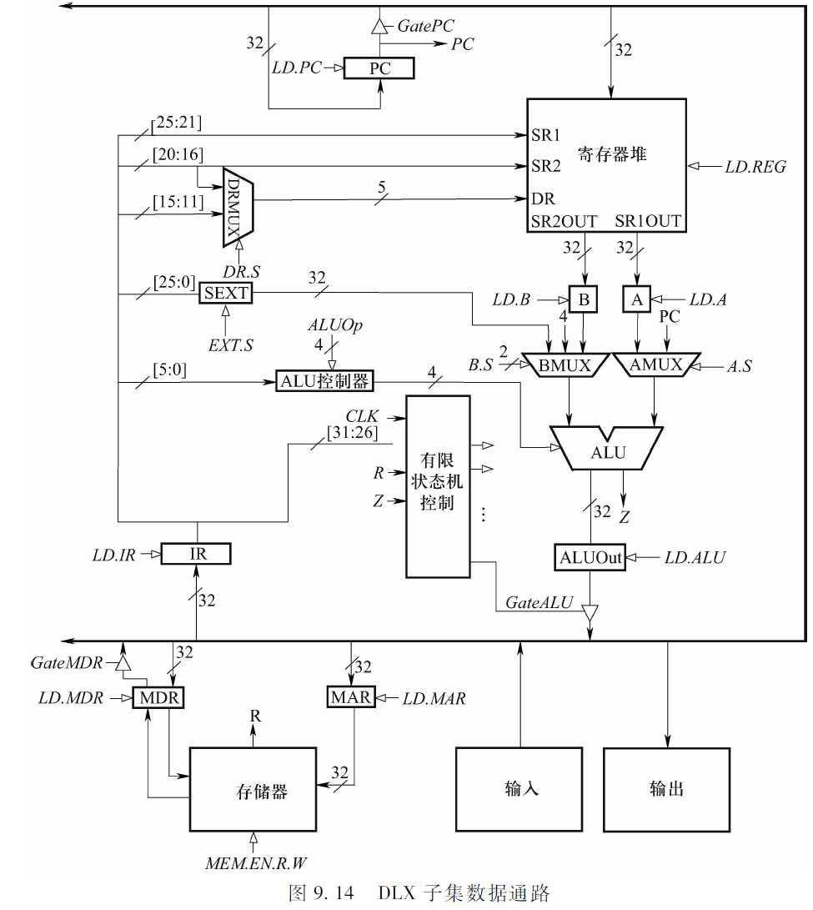

#### 指令处理

- 多时钟周期的实现方案
  - 指令的每一步将占用 一个时钟周期
  - 不同的指令可能被分解不同的步骤
  - 占用不同的时钟周期, "多周期"因此得名
- 在现代计算机中, 时钟周期以纳秒 (或称毫微秒, 十亿分之一秒) 为单位
  - 一个3.3GHz的处理器在1秒内有33亿个时钟周期, 即一个时钟周期只需0.303纳秒.

#### DLX指令执行阶段

- 按照DLX指令执行的步骤，将处理指令所需的操作划分为以下阶段:
  - 取指令 (Instruction fetch)
  - 译码/取寄存器 (Instruction decode/Register fetch)
  - 执行/有效地址/完成分支 (Execution/Effective address/Branchcomp let ion)
  - 访问内存 (Memory access)
  - 存储结果  (Write-back)
- 每条DLX指令需要其中的3到5个阶段

1. ##### 取指令阶段

   - 第一个时钟周期 (状态1)
     - PC中的内容通过总线被加载到MAR中.
     - 在ALU中执行PC+4的运算.
     - 有限状态机发出的控制信号有: 
       - GatePC=1 (使得PC的值能加载到总线)
       - LD.MAR=1 (使得总线上的值能加载到MAR)
       - A.S=1 (使得PC的值被加载到AMUX)
       - B.S=01 (使得4被加载到BMUX)
       - ALUop=0001 (使得ALU做加法运算)
       - LD.ALU=1 (使得ALUout能存放输出结果)
   - 下一个时钟周期 (状态2) (如果存储器能在下一个时钟里提供信息)
     - 存储器被读取, 指令内容被加载到MDR.
     - PC+4的结果加载到PC.
     - 有限状态机发出的控制信号有: 
       - GateALU=1
       - LD.PC=1
       - MEM.EN.R.W=0 (读取信号)
       - LD.MDR=1
       - 就绪信号R (Ready) 在读完后设为1
   - 再下一个时钟周期 (状态3)
     - MDR中的值被加载到指令寄存器 (IR).
     - 有限状态机发出的控制信号有: 
       - GateMDR=1
       - LD.IR=1

2. ##### 译码/取寄存器阶段

   - 下一周期 (状态4)
     - IR中指令操作被译码: 确定下一步要去做什么. 根据操作码 (IR[31:26]), 控制逻辑发出正确的控制信号 (空心箭头), 从而控制指令的执行.
     - 取寄存器: 为后面阶段获取操作数
       - 读取IR[25:21]的内容, 写到寄存器A中; 读取IR[20:16]的内容, 写到寄存器B中.
       - 在ALU中执行PC+SEXT(IR[15:0]), 结果存储于ALUout中.
     - 有限状态机发出的控制信号有: LD.A=1, LD.B=1, A.S=1, B.S=00, EXT.S=0, ALUop=0001, LD.ALU=1.

3. ##### 处理指令: 执行/有效地址/完成分支

   - 根据译码产生的控制信号执行算术或逻辑运算, 或计算有效地址, 或完成分支
   - <u>要用从左往右数第几根数据线, 控制信号就设为几 (二进制)</u>

4. ##### 访问内存

   - 下一周期 (或多于一个, 如果访问存储器需要多于一个周期的话)
     - 获取内存中的数据
     - 有限状态机将GateALU和LD.MAR设为1, 将ALUout中的值通过总线传给MAR. 将MEM.EN.R.W设为0, LD.MDR设为1, 读取存储器中的数据.

5. ##### 存储结果

   - 最后一个周期
     - 结果被写进指定的目标中

6. ##### 下一阶段

   - 以上五个阶段完成后, 控制单元就会从取指令阶段开始执行下一条指令.
   - 处理就这样持续下去直到被打断
   - 不是所有的DLX指令都包含上述五个阶段
   - 所有指令都需要取指令阶段和译码/取寄存器阶段

### 9.6 C语言的数据类型和计算机的ISA

- 3种基本类型的数值范围
  - int, 一个底层ISA的字长的二进制补码整数. 在DLX上范围是$[-2^{31},2^{31}-1]$
  - char, 8位, 在DLX中只占用一个存储单元
  - double, 64位. float是32位.
- 3种基本类型的变化
- 类型提升
  - 在C语言中较短1类型会被转换成较长的类型.

## 第10章 机器语言程序设计

### 10.0 补充

- 高级语言
  - 与底层计算机指令集无关, 独立于机器, 不能直接被计算机执行, 被翻译为目标机器 ISA 的二进制指令序列.
- 低级语言
  - 与执行程序的计算机指令集紧密相关
  - 汇编语言: 依据指令集的汇编语言格式编写, 需经过语言处理, 翻译为机器语言才能在计算机上执行
  - 机器语言: 依据指令集使用二进制编码, 直接在计算机上执行, 不需要经过语言处理
- 低级语言的作用
  - 硬件控制, 系统编程, 性能优化, 调试和逆向工程

### 10.1 解决问题

- 进行机器语言程序设计时, 仍然采用结构化程序设计的思想, 即采用系统分解的方法来设计程序
- 三种基本结构: 顺序, 选择, 循环
- 顺序
  - 第一个子任务 > 第二个子任务
- 选择
  - 生成条件指令 (将某个寄存器设置为零/非零) > 条件分支指令 > 子任务2 > J指令 > 子任务1
- 循环
  - 生成条件指令 > 条件分支指令 > 子任务 > J指令
- 示例: 文档加密

### 10.2 调试

- ~~没讲~~	