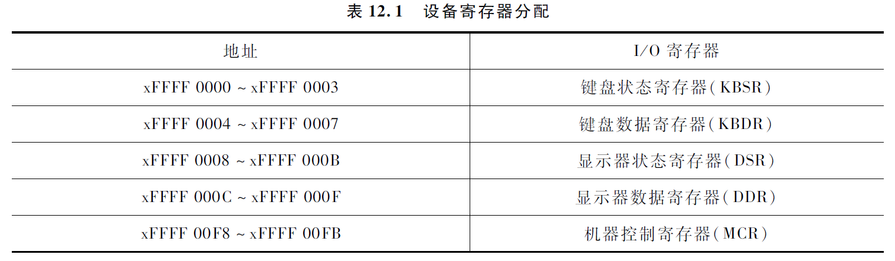
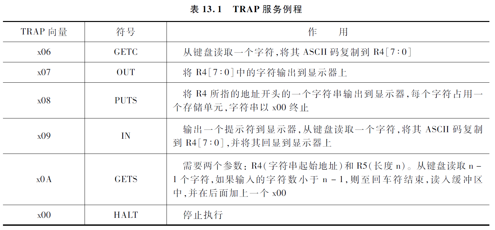
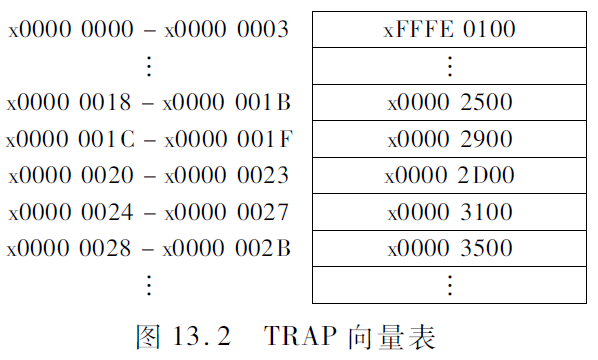
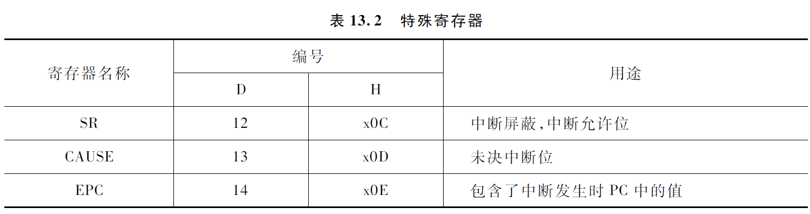
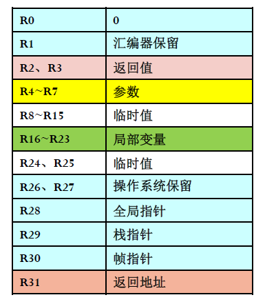
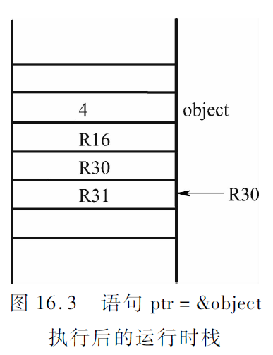
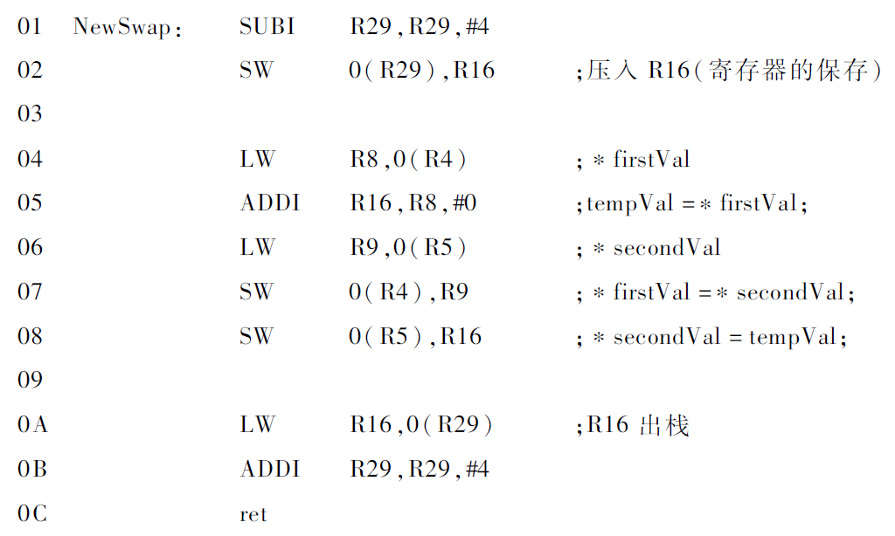

[TOC]

# 计算系统基础

- 一些内容使用了LaTeX内联公式, 使用Typora或其他软件查阅即可获得原汁原味的效果. (当然也可以下载Html版本) (下载md文件不要忘了把插图也下载下来)
- 摘要: 赛博抄书.
- 怎么来的: 只能说还是你南给我一周以上的时间去复习这么一门课, 我才有机会码完 ~~(复制粘贴完)~~ 两万多字的内容, 个人感觉还是比教材好肯的.
- 除了复制粘贴还干了啥: 整合了一些课上PPT的内容, 但整体顺序是大致符合教材的大纲的 (个人感觉教材的顺序在学习的逻辑上比PPT好稍微那么一点)
- 一些吐槽: 抛开C语言的内容, 这本书的其他内容其实有不少是重复出现过的, 但这些内容又不完全重合. 你可以理解为在书的前面编者为了讲这个知识点不得不扯到后面内容的知识点, 但是又怕你不懂不能深入去讲, 只能在书的后面再讲一遍.
  可能是我上课摸鱼太多, 导致这本书里面的重点内容我是在写这份东西的时候才懂的, ~~(疑?悟!)~~. 个人感觉做这份工作还是满有益的, (可以充分防止走神) 虽然很枯燥.

## 第0章 期末梳理

#### 第1部分 自底向上

- 第6章~第9章
  - 如何由简单的元件组成计算机
  - 如何使它们执行计算机语言编写的程序

#### 第2部分 计算机实例-DLX

- 第10章~第14章
  - 汇编语言程序设计 (包括子例程)
  - I/O基础 (系统调用, 轮询)
  - 汇编过程 (两趟, 符号表)

#### 第3部分 C语言与机器语言的联系

- 目的
  - 使用高级计算机语言 (C语言) 编写比较复杂的程序
  - 理解这些程序是如何在计算机这一复杂机器内部执行的
- 第15章~第17章
  - C语言程序设计
  - 高级语言处理 (C-DLX)
  - 寄存器分配规则 (理解)

## 第1章 引言

### 1.2 计算机与计算机系统

#### 计算机

1. 通用计算设备
   - (阿兰·图灵) 所有计算机都可以做相同计算，只是在计算速度上有差别
   - 新的计算形式，只需安装合适的软件，无需新计算机
2. 电子设备
   - 计算最终是通过电子电路中的电流、电位等实现的
3. 数字设备
   - 所有信息都是采用数字化的形式表示
   - 区别于模拟设备: 通过测量物理量 (距离或电压) 计算.
4. *计算机理论模型: 图灵机
   - 思想模型, 对应一个抽象的机器
     - 无限长的纸带 (Tape), 由一个个小方格 (Cell) 组成, 包含有限符号集 (0/1/其他字符)
     - 一个可在纸带上左右移动的机器/读写头 (Head)
     - 一组状态 (State): 机器内部状态, 确定下一动作
     - 转移函数 (Transition Function): 定义了在给定状态和读取头上的符号情况下, 图灵机应采取什么行动 (操作): 写入新符号, 移动读写头 (左或右), 并切换到新状态
   - 过程: 
     1. 从初始状态开始, 读写头位于纸带上的某个位置.
     2. 根据当前状态和读写头所在的单元格上的符号, 图灵机通过转移函数来确定下一步的动作: 读取当前符号, 写入新符号, 移动头的位置, 并切换到新状态.
     3. 图灵机根据转移函数执行相应的操作, 然后进入新的状态.
     4. 步骤2和步骤3重复进行, 直到图灵机进入一个特定的停机状态 (Halt State) 或者永远不停机.
5. 计算机
   - 核心处理部件是CPU (Central Processing Unit, 中央处理器), 其最重要的工作是执行指令
   - 指令说明计算机执行一件明确定义的工作. 
   - 计算机程序: 由一组指令组成. 指令是计算机程序中规定的可执行的最小工作单位.
   - 现代计算机由冯·诺依曼提出的"存储程序控制原理"思想构建. 
     - 核心部件有CPU和存储器 (内存). 
     - CPU负责完成两项工作: 指挥信息的处理 (从存储器/内存 (memory) 里读取下一条指令) 和执行信息的实际处理 (即执行该指令), 这两项工作循环进行.

#### 计算机系统

- 由硬件和软件两部分组成
- 硬件系统: 中央处理器 (运算器, 控制器, 寄存器), 存储器 (內: RAM, ROM, 外: 硬盘), 输入设备, 输出设备
- 软件系统: 系统软件 (操作系统, 数据库系统, 程序设计语言), 应用软件

### 1.3 计算系统

- 计算系统使用电子解决问题的过程可表示为7个抽象层次.
- 抽象层次: 每一层对它的上一层隐藏了自己的技术细节.
- 从顶到底: 问题 > 算法 > 程序 (语言处理 > 操作系统) > 指令集结构 > 微处理器 > 逻辑电路 > 元件
- 本书的目标即解释这个系统.

#### 问题

- 自然语言描述具有"歧义性", 不能直接作为计算机的指令.
- 计算机是电子设备, 只能机械执行明确的指令.

#### 算法

- 将自然语言描述的问题转换成一个无歧义的操作步骤即是算法 (Algorithm).
- 有限性: 程序最终能够结束
- 确定性: 每个步骤都必须是明确的, 不应存在歧义性.
- 有效可计算性: 每个步骤都能被计算机执行

#### 程序

- 使用程序设计语言把算法转换为程序.
- 程序设计语言与自然语言不同, 它是用于表达计算机指令的语言, 不存在歧义性.
- 高级程序设计语言: 编译型, 解释型
- 低级程序设计语言: 汇编语言 (用助记符号书写语言), 机器语言 (用机器码书写指令, 不需要进行语言处理)

#### 语言处理

- 高级语言 -(编译, 高级语言处理)> 汇编语言 -(汇编, 低级语言处理)> 机器语言 -(运行)> 计算机

#### 操作系统

- 最初功能: 包含支持输入/输出 (I/O) 操作的设备管理例程 (本书范围).
- 扩展实现: 文件管理, 内存管理, 进程管理等功能.

#### 指令集结构

- 高级语言程序翻译成机器语言的依据就是目标机器的指令集结构 (Instruction Set Architecture, ISA).
- 是程序和底层计算机硬件之间的接口 (Interface) 的完整定义.
- 规定了操作数, 数据类型, 寻址模式.

#### 微处理器

- 每一种指令集结构都可以采用多种微结构来实现.
- 对于计算机设计者来说, 每一种实现都是一次对微处理器的成本和性能之间的平衡.

#### 逻辑电路

- 组成微处理器的每一个组件的逻辑电路的实现.
- 也需要尽量平衡成本和性能.

#### 元件

- 每一种基本的逻辑电路都由特定的物理元件实现.

### 1.4 本书的结构

- 6~14章: 描述从晶体管到逻辑电路, 到处理器, 到指令集结构, 到程序的转换. (自底向上)
- 15~17章: 将C语言程序和底层的DLX联系起来, 以便理解在C语言程序中使用某一种结构时, 在底层的计算机是如何实现的.

## 第6章 数据的机器级表示

### 6.1 位和数据类型

#### 信息的最小单位-位

- 0和1被称为比特 (bit), 或位
- 字长: 计算机CPU (ALU) 一次能并行处理的二进制位数通常被称为计算机的字长 (word length), 每一个元素被称为一个字 (word).

#### 数据类型

- 在计算机上能对以某种表示法编码的信息进行运算, 这种特殊的表示法就被称为数据类型.
- **大端法和小端法**: 两种不同的字节序 (Byte Order) 的表示方式, 用于确定多字节数据存储时哪个字节位于起始位置
  - 大端法 (Big Endian, BE): 最高有效字节位于最低的内存地址, 最低有效字节位于最高的内存地址
  - 小端法 (Little Endian, LE): 最低有效字节位于最低的内存地址, 最高有效字节位于最高的内存地址

### 6.2 整数数据类型

#### 无符号整数

- 使用$k$位数, 就可以表示从$0$到$2^k-1$共$2^k$个整数

#### 有符号整数

- 正数: 按照位置计数法直接表示, 有$k$位就用$2^k$个码字的一半来表示从$0$到$2^k-1$的正数. $0$和所有正数都是以$0$开头的
- 负数
  - 原码: 将一个正数的最高位设为1表示其对应的负数
  - 反码: 对正数"按位取反"来表示其对应的负数
  - 补码: 符合硬件需求

### 6.3 二进制补码正数

- 几乎所有计算机使用相同的基本结构进行加法运算, 称为算术逻辑单元 (Arithmetic and Logic Unit, ALU)
- $-A$的表示可以通过把$A$的反码加1得到, 即"取反加一".

### 6.4 二进制-十进制转换

- 二进制到十进制的转换
  - 若最高位为1, 先得到与其绝对值相同的正数的二进制补码表示 (即"取反加一")
- 十进制到二进制的转换
  - 对十进制数$N$"除2取余", 将余数从高位向低位依次排列 (即最后得到的余数放在最高位), 得到$N$的绝对值的二进制表示
  - 如果$N$为正, 则在前面补0. 如果为负, 则先补0, 再计算出这个补码二进制数的负数 (即"取反加一").

### 6.5 算术运算

#### 加法和减法

- 二进制补码的算术运算与十进制运算十分相似

#### 符号扩展

- 对两个具有不同长度的数值做加法, 首先必须将它们表示为相同的长度
- 用0来扩展一个正数的左端, 它的值不会改变; 用1来扩展一个负数的左端, 它的值也不会改变.
- 在这两种情况中扩展的都是符号位, 这种运算被称为符号扩展 (Sign-Extension, SEXT)

#### 溢出

- 只有两个符号相同的数相加才有可能会导致溢出, 正数和负数相加永远不会出现溢出.

### 6.6 逻辑运算

#### 基本运算

- 与函数 (AND): 被看作ALL运算
- 或函数 (OR): 被看作ANY运算
- 非函数 (NOT): 一元函数, 只作用于一个操作数
- 其他任何逻辑函数都可以写成以上三种基本逻辑运算符的逻辑组合
- 异或函数 (XOR): 相异为$1$, 相同为$0$
- 同或函数 (XNOR): 相异为$0$, 相同为$1$

#### 布尔代数

- 基本运算符: 与 (·), 或 (+), 非 (-)
- 定律: 分配律, 结合律
  - 吸收律: $A+A·B=A$， $A·(A+B)=A$
  - 德摩根定律: $-(A·B·C)=(-A)+(-B)+(-C)$, $-(A+B+C)=(-A)·(-B)·(-C)$
  - 其他: $A+(-A)·B=A+B$, $A·((-A)+B)=A·B$

### 6.7 其他表示法

#### ASCII

- 美国信息交换标准代码
- 0 -> D48, H30
- A -> D65, H41
- a -> D97, H61

#### 浮点数类型

- 十进制转二进制:

  1. 整数部分, 采用除2取余法
  2. 小数部分, 采用乘2取整法

    - 比如$(0.6875)_{10} = (0.1011)_2$

- 单精度浮点数 (float) 类型 (32位)

  - [31]位表示符号$S$ (正或负), [30:23]位 (共8位) 表示范围$exponent$ (指数域), [22:0]表示 (共23位) 表示精度$fraction$ (分数域)
  - $V_{float}=
        \left\{
        \begin{aligned}
            (-1)^s \times 1.f \times 2^{e-127}, \ 1 \leq e \leq 254  \\
            (-1)^s \times 0.f \times 2^{-126} \ e = 0 \\
            (-1)^s \times 1.f \times 2^{128} = Infinity(+and-), \ e = 255,f = 0\\
            NaN(Not \ a  \ Number), \ e = 255, f \neq 0
        \end{aligned}
        \right.$
  - 第一部分是符号位$S$: 0代表正数, 1代表负数
  - 第二部分是指数部分: 采用8位二进制无符号整数. 对于其指数域內的254个值 (1~254) 解释如下: 实际上被表示的指数是该无符号整数减去127后得到的数值
  - 第三部分是分数部分. 当$exponent$在区间1~254时, 分数是规格化的, 只有唯一一位非0的二进制数出现在二进制小数点的左端, 为1, 因此实际表示的是24位的精度.
    - 当$exponent$为`0000 0000​`时, 指数是-126, 得到的有效数字以0为开头
    - 当$exponent$为`1111 1111`, 如果分数域全为0, 则表示正/负无穷, 如果分数域不全为0, 则该数表示"非数值"

- 双精度浮点数 (double) 类型 (64位)

  - 符号位1位[63], 指数11位[62:52], 分数52位[52:0]
  - $V_{double}=
        \left\{
        \begin{aligned}
            (-1)^s \times 1.f \times 2^{e-1023}, \ 1 \leq e \leq 2046  \\
            (-1)^s \times 0.f \times 2^{-1022} \ e = 0 \\
            (-1)^s \times 1.f \times 2^{1024} = Infinity(+and-), \ e = 2047,f = 0\\
            NaN(Not \ a  \ Number), \ e = 2047, f \neq 0
        \end{aligned}
        \right.$

- 浮点数加减运算: 

  1. 转为二进制规格化小数  
  2. 对指数操作: 小阶向大阶看齐, 使指数相等  
  3. 尾数运算:  
     - 符号位+二进制数补码 (含隐藏位) 运算
  4. 结果规格化: 
     - 尾数相加有进位 (符号位判断溢出规则), 阶码加1
     - 尾数相减, 隐藏位有错位 (即隐藏位变成0)
  5. 舍入操作: 对丢失的位进行舍入处理
     - IEEE浮点舍入方式: 就近/向正无穷/向负无穷/向零舍入
     - 就近舍入 (单精度):
       - 超出23位的多余位大于等于10···01, 尾数最低有效位加1
       - 小于01···11, 直接舍去
       - 等于10···00, 尾数最低有效位为0, 直接舍去, 为1则再加1
  6. 判断指数/阶码是否溢出: 向上/向下溢出
  7. 运算规则: 加法不具备结合性, 乘法不具备结合性, 乘法在加法上不具备结合性

  

#### 十六进制表示法

- 将每4位二进制转换为1位十六进制

#### 八进制表示法

- 将每3位二进制转换为1位八进制

### 6.8 C语言中的数据类型

- ~~(没啥好写的)~~

## 第7章 数字逻辑电路

### 7.0 补充

#### 集成电路

- 采用一定工艺, 把一个电路中所需的晶体管, 二极管, 电阻, 电容和电感等元件及布线互连一起, 制作在一/几小块 半导体 (硅) 晶片/介质基片上, 封装在一个管壳内, 使其具有所需电路功能.
- 特点: 小体积, 低功耗, 高可靠

#### 摩尔定律

- 集成电路上的元器件集成度每隔18~24个月便会增加一倍, 成本保持不变

### 7.1 晶体管

- 微处理器 (计算机的核心) 是由MOS晶体管组成的, MOS晶体管有N型和P型, 在逻辑上起开关的作用.
- N型MOS晶体管有3个终端, 控制端称为栅极 (Gate), 接地一端称为源极(Source), 源极电压记作$V_{SS}$, 接正电压一端称为漏极 (Drain), 漏极电压记作$V_{DD}$, 其源极不能接电源正极.
- 如果N型MOS晶体管的栅极被施加3.3V电压, 源极到漏极间相当于一段电线, 即存在闭合回路, 导通. 如果被加上0V电压, 则断路.
- P型MOS晶体管作用与N型互补, 其源极不能接地, 当其被施加0V电压时电路导通. (多一个小圆圈)
- 既包含P型又包含N型MOS晶体管的电路称为CMOS电路

### 7.2 门电路

- 只使用MOS晶体管就可以构建最基本的门电路, 即实现与, 或, 非逻辑运算的晶体管电路, 相应的电路称为与门, 或门, 非门.

#### 非门 (反相器)

- 由1个P型MOS晶体管和1个N型MOS晶体管组成
- 标准符号 (形状特征型符号): 图7.4 (e)
- 
- 矩形国标符号:  

#### 或门, 或非门

- 或非门由2个P型MOS晶体管和2个N型MOS晶体管组成
- 标准符号 (矩形国标符号): 图7.5 (e)
- 
- 或门: 即或非门加上一个反相器
- 

#### 与门, 与非门

- 

### 7.3 组合逻辑电路

- 逻辑结构可分为两种基本类型: 能够存储信息, 不能存储信息
- 不能存储信息的逻辑结构被称为"判定元件", 通常将它们称为组合逻辑结构.
- 它们的输出仅由当前输入值的组合决定, 不由任何过去存储在其中的信息所决定, 因为信息不能被存储在组合逻辑电路中.

#### 译码器

- 用来判断某个位组合, 如存储器中使用译码器来识别存储单元的地址
- 译码: 将特定含义的二进制码转换成输出信号, 是编码的逆过程
- 有$n$个输入, $2^n$个输出. 只有一个输出为1, 其他全为0. 即被检测的输入组合的输出线被设置为1, 所有其他的输出为0. (这是高电平有效, 低电平有效则相反)

#### 多路选择器

- 用来从多个输入中选择一个输入连接到输出. 选择信号S决定由哪个输出连接到输出.
- 一个多路选择器由$n$条选择线和$2^n$个输入组成.

#### 全加法电路

- 容易理解的版本: 先作出真值表, 只考虑与门输出为1的组合, 把它们用或门串联
- 图7.13 (c)表示一个能进行两个4位二进制加法运算的逻辑电路图, 第$i$列的进位时第$i+1$列进行加法运算的一个输入
- 

#### 可编程逻辑阵列 (PLA)

- 由一组与门 (与阵列) 和一组或门 (或阵列) 组成.
- 与门的数目对应于真值表中输入组合 (行) 的数目, 对于有$n$个输入的逻辑函数, PLA包含$2^n$个与门, 每个与门有$n$个输入, 将相应的与门的输出和或门的输入相连就可以实现真值表.

#### 逻辑完备性

- 任意逻辑函数都可以通过一个PLA来实现.
- 借助一些布尔代数定律和德摩根定律, 有时可以减少门的数目.

### 7.4 基本存储元件

#### R-S锁存器

- 由两个二输入的与非门组成, 其中任意一个的输出都是另外一个的输入, 其余的输入R和S通常被赋以逻辑值1
- R和S保持为1, 该电路的状态就不会变, 因此称R-S锁存器存储了一个值
- 可以保持R的值为1并将S的值瞬间设为0, 从而把a的值设为1; 同理, 可以保持S的值为1并将R的值瞬间设为0, 从而把a的值设为0 (也叫清空).
- 不能将R和S的值同时设为0, 否则这个锁的最后状态将取决于组成门的晶体管的电子特性而不是取决于被操作的逻辑值.
- 也可以用或非门实现, S和R的设置与上面相反
- 

#### 门控D锁存器

- 对R-S锁存器何时设为1, 何时清空进行控制
- 对R-S锁存器增加两个额外的门
- 仅当WE (Write Enable) 被设置为1时才能被设为输入D的值
- 保证了S和R不同时为0
- 

#### 主从D触发器

- [主从触发器](####主从触发器)

#### 锁存器和触发器

- 共同点: 都具有存储功能, 都是时序逻辑电路的基本逻辑单元
- 锁存器: 对脉冲电平 (0/1) 敏感的存储电路, 输入变输出立刻变. 当输入信号不稳定, 输出会出现毛刺. 消耗的门资源相对较少.
- 触发器: 对脉冲边沿 (上升/下降沿) 敏感的存储电路, 状态只在时钟上升沿或下降沿到来的瞬间改变. 不易产生毛刺. 消耗的门资源相对于锁存器多.

#### 寄存器

- 门控D锁存器只能实现一位的存储
- 寄存器 (Register) 就是将多位数据存储到一个独立单元中的结构, 把多位数据捆绑成一个单元. 寄存器可以根据需要包含1位或多位数.
- 编号顺序自右向左, 最右边的为[0].

### 7.5 存储器

#### 地址空间

- 可唯一标识的单元总数称为存储器的地址空间
- 使用$n$位地址能够唯一标识出$2^n$个单元

#### 寻址能力

- 存储在每个单元中的位数是存储器的寻址能力
- 大多数存储器的字节是可寻址的

#### 样例: 一个4x2位的存储器

- 
- SRAM (Stati Random Access Memory, 静态随机访问存储器), 只要给它供电, 其内部数据就不会丢失, 可以一直保存, "静态"由此得名.
- 读取单元2: WE设为0, 地址A设为[1:0]=10被译码, 相应的字线被设为1. 存储器的每一位都与其字线进入与门, 然后将其输出与其他字的相应位进入或门, 这在效果上相当于一个多路选择器, 译码器的输出为每一位提供了选择功能, 使得相应的字被读出来.
- 写入单元2: 寻址与读取相似, 但WE被设为1, 与译码器的结果做与运算, 将D中的值[1:0]写入单元2.

### 7.6 时序逻辑电路

- 既能处理信息 (即判定) 也能存储信息的数字逻辑电路.
- 可以用来实现**有限状态机**的机制.
- 位于计算机核心的就是有限状态机控制器.

#### 状态的概念

- 一个系统的状态, 是在某一特定时刻, 系统内所有相关部分的一个瞬态图.

#### 有限状态机

- 存储元件 (寄存器) 的容量是有限的, 所以状态的数目是有限的
- 有限状态机由5个元素组成: 有限数目的状态, 有限数目的外部输入, 有限数目的外部输出, 明确定义的状态转换函数, 明确定义的外部输出函数.
  1. 状态图: 有限状态机可以用状态图表示出来
  2. 时钟: 触发状态从一个向下一个转换的机制是时钟电路, 通常称为时钟, 其信号值在0和1之间交替. 
  3. 在实现有限状态机的电路中, 从一个状态向另一个状态的转换发生在每一个时钟周期的开始.

#### 样例: 交通灯控制器

- 电路分析

  - 1个外部输入, 表示行人按下按钮的行为;
  - 4个外部输出, 用于控制4个灯是否亮
  - 2个内部存储元件, 用来记录控制器处于哪一个状态 (有3种状态, 使用2位就可以唯一标识)
  - 周期为0.5分钟的时钟信号
  - 

- 组合逻辑

  - 需要两组输出: 一组用于控制灯的亮灭, 一组用于判断存储元件的输入 (即给出下一个状态)
  - 

- 存储元件

  - 不能使用门控D锁存器, 原因是在当前的时钟周期里, 存储元件的输出是穿组合逻辑电路的内部输入, 组合逻辑电路的内部输出则成为了存储元件的新的输入, 该输入应该在下一时钟周期发生作用. 使用门控D锁存器, 输入会立即发生作用改写存储元件中的值而不是等到下一周期开始再改写.
  - 应该使用**主从触发器**
  - 

#### 主从触发器

- A为主锁存器, B为锁存器, 使能信号 (WE) 相反
- 实现存储数据和输入信号之间的隔离
- 时钟周期前半段时钟信号为1, A锁中的值不可能被改变, 并且B锁的值与A锁保持一致, 成为组合逻辑电路的内部输入.
- 时钟周期后半段时钟信号为0, B锁的值不可能被改变, 由组合逻辑产生的下一状态改变了A锁中的值, 为下一周期改变B锁的值做好准备.
- 时钟信号由0变1的瞬间, A之前锁存的值保持不变, B锁的输出改变为A中锁存的值.

### 7.7 DLX子集的数据通路

- 数据通路是指再计算机内部用于处理信息的所有元件的总和.

## 第8章 冯·诺依曼模型

- 运用判定元件和存储元件来构建冯·诺依曼结构计算机

### 8.1 基本组件

- 
- 处理单元和控制单元是**CPU**的主要组成部分
- 由指令组成的**程序**和程序所需的**数据**位于**存储器**中
- 指令的**执行**由运算器**处理单元**完成
- 指令执行的**顺序**由**控制单元**来控制
- **输入设备**将程序和所需的数据送入计算机
- **输出设备**将执行结果出计算机之外

#### 存储器

- 由基本存储元件构成 (锁存器, 触发器)
- 寄存器: 存储多位信息
- 内存/主存储器 (Memory)
  - 是存储信息的二维阵列, $2^n$行, 每行$m$位. 
  - 每一行是一个存储单元 (Memory Location), 包含一定大小的内容 (指令和数据).
- 地址: 和每一个单元联系在一起的唯一的标识符
- 地址空间: 唯一可识别的单元总数
- 寻址能力: 存储在每个单元的位数
- *SRAM
  - 静态随机访问存储器 (Static Random Access Memory)
  - 结构相对简单
  - “静态”: 只要给它供电，其内部数据就可以一直保存
  - “随机访问”: 可以以任意顺序访问, 而不必关心前一次访问的是哪一个单元
  - 存储元: 可以用更少的晶体管实现
- *DRAM
  - 动态随机访问存储器
  - “动态” : 使用电容存储电荷保存数据
    - 必须隔一段时间刷新 (refresh) 一次
    - 如果存储单元没有被刷新, 存储的信息就会丢失
    - 关机也会丢失数据
  - “随机访问” : 可以以任意顺序访问，而不必关心前一次访问的是哪一个单元
  - 存储元: 采用动态存储单元, 最常见的系统内存

#### 处理单元

- 基本的冯·诺依曼模型处理单元只包含最简单的单元ALU (Arithmetic and Logic Unit, 算术和逻辑单元)
- 字和字长: DLX的字长为32位.
- 寄存器堆/文件Reg: 用于临时存取一些不久就会在计算中使用的数据数据.
  - 每个寄存器都包含一个字.
  - DLX有32个寄存器.

#### 控制单元

- 处理单元负责"执行信息的实际处理", 而控制单元则"指挥信息的处理"
- 具体工作:
  - 在执行程序的过程中，**跟踪**存储器中的指令
  - 在处理指令的过程中，**跟踪**指令的处理阶段
- 跟踪存储器中的指令, 即跟踪要处理的下一条指令. 控制单元有一个用来容纳下一条指令所在地址的寄存器, 即**程序计数器** (Program Counter, PC), 也叫"指令指针", 即寄存器的内容在某种意义上指向要运行的下一条指令.
- 控制单元可以是多个控制器: 如ALU控制器用于控制ALU执行何种运算, 对于输入和输出则有专门的I/O控制器.

#### 输入/输出设备

- 要使计算机处理信息, 信息必须被送入计算机.
- 为了能够使用处理后的结果, 它必须能以某种形式显示在计算机以外.
- 为输入和输出的目的而出现的设备在计算机术语中被称为外围设备 (peripherals).

### 8.2 DLX-冯·诺依曼模型示例

- 对计算机基本组件的再解释
  
- DLX数据通路
  - 一个采用**总线结构**、**多时钟周期**的实现方案
  - "数据通路": 计算机内部用于处理信息的所有元件的总和
  - 各种寄存器: 寄存器堆/文件, 程序计数器PC, 指令寄存器IR
  - 多路选择器
    - DRMUX提供一个5位的地址给寄存器堆
    - AMUX和BMUX分别提供一个32位的数值给ALU
  - 每根用交叉斜线标记32的线表示该线内共有32条线, 每条用来传送1位的信息
- DLX总线
  - 两端都有箭头的粗黑线结构代表数据通路的总线
  - 优点: 功能多, 成本低; 缺点: 性能和带宽对计算机性能有重要影晌.
  - 在总线上一次只可传输一个值, 每一个提供数据给总线的组件在它的输入箭头后都有一个三角形 (称为三态设备), 使计算机的控制逻辑一次只允许一个提供者能提供信息给总线
  - 从总线获得数据的组件通过将LD. x  (加载使能) 信号设为1, 从而得到信息.
- 存储器
  - 主存地址寄存器 (Memory Address Register, MAR)
    - 保存数据传输**目的位置**或者数据**来源位置**的**地址**
    - 32位, 反映了DLX的存储器的地址空间是$2^{32}$个存储单元
  - 主存数据寄存器 (Memory Data Register, MDR)
    - 保存要**被写入**地址单元或者从地址单元读入的**数据**
    - 32位
    - 在大多数情况下, MDR包含从MAR中的地址开始的**4个连续单元**的**数据**. 有时包含的是MAR所指的单元中的数据 (8位) 符号扩展的结果 (32位).
  - 如果要读出某个存储单元中的内容, 首先把它的地址存入地址寄存入 (MAR), 然后查询存储器, 该地址所对应的存储单元的内容将会输出到数据寄存器 (MDR).
  - 如果要写一个值到存储单元中，首先要把目的地址存入MAR, 把值存入MDR中, 然后设"写使能"信号为1, 查询存储器, MDR里的信息就会被写到MAR中的地址所对应的存储单元里.
- 处理单元
  - 包括一个能进行算术和逻辑运算的功能单元ALU和寄存器堆.
  - 图8.3给出的是DLX子集的数据通路, 未包括整数乘法, 除法及浮点数运算等操作, 也未包括浮点寄存器.
- 控制单元
  - 包括所有用来管理计算机信息处理的组件. 最重要是有限状态机, 负责指挥所有行为.
  - 指令被一个时钟周期一个时钟周期地执行.
  - 有限状态机的一个输入是CLK, 它说明了每个时钟周期持续的时间.
  - 程序计数器 (PC) 记录了下一条要被执行的指令所在的地址.
  - 指令寄存器 (Instruction Register, IR) 用来保存正在处理的指令, IR也是有限状态机的一个输入.
  - 实心箭头表示沿着相应通路流动的是**数据元素**
  - 空心箭头表示控制数据元素处理的**控制信号**, 有限状态机的所有输出都是空心箭头, 如
    - LD.IR (1位), 控制了当前时钟周期内, 指令寄存器 (IR) 是否要从总线上加载新的指令.
    - GateALU, 决定ALUOut的值在当前时钟周期内是否被提供给总线.
- 输入/输出设备: 见第12章

### 8.3 指令处理

- (这一部分在第9章再展开)

#### 指令

#### 多周期实现方案

#### 改变执行方案

### 8.4 DLX的有限状态机

- 一条指令的执行可能包含3~5个阶段, 每一个阶段还由一些步骤组成, 而每一个阶段的每一步都是由控制单元的有限状态机控制的.
- 每条指令的执行都是以返回到状态1结束, 有限状态机可一个周期接一个周期地控制整个计算机程序的执行.
- 停止时钟就可以停止指令的执行.
- 

#### 时钟

- 包含一个时钟发生器和一个运行锁.
- 时钟发生器是一个石英晶体振荡器, 能产生震荡电压
- 将运行锁清0就可以停止指令运行.
- 

## 第9章 指令集结构

- 指令集结构 (ISA) 是软件指令和执行命令的硬件之间的接口。

### 9.1 指令集结构概述

- 指令集结构指明了再一台机器上编写软件时要注意的全部信息, 换句话说, ISA规定了程序员使用机器语言编程时的全部信息.
- ISA规定了存储器的组织, 寄存器集和指令集, 包括操作码, 数据类型和寻址模式.

#### 存储器组织

- DLX的存储器有$2^{32}$个地址空间的单元, 8位的寻址能力, 但不是所欲地址都用作存储单元.
- DLX通常处理的数据单元都是8比特大小, 8比特又称为一个字节, 因此DLX是可寻址的.
- DLX使用高位优先 (大端法) 的方式, 将字的高位字节放在内存的低地址端, 低位字节放在高地址端.
- DLX规定字的起始地址必须是4的倍速, 即**边界对齐**.

#### 寄存器

- 在一个时钟周期內访问数据的附加临时存储空间
- 最常用的是DLX所采用的通用寄存器集, 其中的寄存器都被称为通用寄存器 (GPR), 共有32个寄存器R0, R1···R31, 每一个寄存器的位数通常是一个字. R0寄存器中的数据必须为0.
- DLX还有32个浮点寄存器, 用于单精度或双精度计算, 共32个, 用F0, F1···,F31表示， 每个32位, 单精度数只需一个浮点寄存器, 双精度数需要两个.

#### 指令集

- 一条指令由操作码 (指令让计算机做的事情) 和操作数 (计算机操作的对象) 组成.
- ISA指令集是由一组操作码, 数据类型和寻址模式定义的. 寻址模式决定了如何计算将要读取/存储的存储单元的地址.
  - CISC (Complex Instruction Set Computer, 复杂指令集计算机), 是功能强大的复杂指令, 开发程序比较容易, 但是由于指令复杂, 指令执行效率较低. 例如Intel的x86指令集.
  - RISC (Reduced Instruction Set Computer, 精简指令集计算机), 指令集较小, 指令执行效率比CISC高, 但是在开发程序方面则有所欠缺. 例如MIPS, SUN的SPARC, IBM的PowerPC. 
  - DLX也是RISC的例子, 有三种类型: I-类型, R-类型, J-类型.

#### 操作码

- DLX ISA的操作码是由指令的[31:26]位定义的, 当其全为0时, 表示指令为R-类型指令, 指令的[5:0]位定义了函数. 非0时指令为I-类型和J-类型.
- 只定义了91条指令, 未被定义的被保留下来
- 指令按照功能可分为4种不同类型, 分别是算术/逻辑运算, 数据传送, 控制和浮点.

#### 数据类型

- 如果ISA的操作码能对以某种表示法编码的信息进行运算, 这种表示法就称为数据类型.
- 如果ISA中有一个操作码能对某种数据类型表示的信息进行运算, 就称该ISA支持这种数据类型.

#### 寻址模式

- 是一种计算将要读取/存储的存储单元的地址的机制.
- DLX只支持一种寻址模式: 基址+偏移量.

### 9.2 算术/逻辑运算指令

- 无论是R-类型还是I-类型, 运算指令的第一个源操作数 (SR1) 都来自于指令[25:21]所标识的寄存器

#### I-类型运算指令

- 第二个源操作数来自于将指令[15:0]进行符号扩展得到的32位整数, 即**立即数**. (Imm16)
- 而目标操作数 (DR) 则来自于指令[20:16]所标识的寄存器.
- `ADDI`-加, `SUBI`-减, `ANDI`-与, `ORI`-或,` XORI`-异或, `SLEI`-是否小于等于, 是返回1, 否返回0, `SLTI`-是否小于, `SEQI`-是否相等, `SRAI`-算术右移立即数 (如果是负数则左边补1), `SRLI`-逻辑右移立即数 (无论正负左边补0), `SLLI`-左移立即数, `LHI`-将立即数左移16位加载到目标操作数中.

#### R-类型运算指令

- 第二个源操作数来自于指令[20:16]所标识的寄存器.
- 目标操作数来自于指令[15:11]所标识的寄存器.
- 除LHI指令外, 其他运算指令均有I-类型和R类型指令, 其解释均与之类似.

### 9.3 数据传送指令

- 本章仅讨论存储器和通用寄存器之间数据的传输.
- 加载 (Ioad): 将数据从存储器移动到寄存器的过程
- 存储 (store): 将数据从寄存器移动到存储器的过程
- `LB`和`SB`指令分别表示加载和存储一个8位的字节, 只需在一个存储单元和一个寄存器之前传送数据.
  `LW`和`SW`指令分别表示加载和存储一个32位的字, 需要在4个连续的存储单元和一个寄存器之间传送数据.
- 均采用I-类型的格式. 需要两个操作数: 一个源操作数SR1[25:21], 一个目标操作数DR[20:16]
- 如果是加载指令, DR寄存器将在从存储器读取数据之后包含该数值. 
  如果是存储指令, DR寄存器则包含了要被写到存储器中的数值.
- 寻址模式: 基址+偏移量

#### 基址+偏移量模式

- 存储单元的地址是通过将16位的偏移量 (指令中的[15:0]位) 进行符号扩展后, 与一个基址寄存器相加得到的
- 偏移量值大小在$-2^{15}$到$2^{15}-1$之间
- R0中的值必须是0, 所以加载指令不可使用R0作为目标寄存器.
- `LB`指令会将一个存储单元的值符号扩展到32位加载到寄存器中.
- `SB`指令会将寄存器的低8位 (最低有效字节) 取出, 存到目标存储单元中.

### 9.4 控制指令

- 控制指令用于改变所执行的指令的顺序
- DLX有10条指令能使顺序流被打破:条件分支, 无条件跳转, 子例程 (有时称为函数) 调用, TRAP, 从异常/中断返回
- 本节只讨论条件分支, 无条件跳转和TRAP指令.

#### 条件分支

- `BEQZ` (操作码101000) 和`BNEZ` (操作码101001) 采用I类型格式
- [31:25]操作码, [25:21]源操作数SR1, [20:16]未用, [15:0]Imm16.
- 使用[25:21]位的寄存器决定是否改变指令流
- 执行: (取指令和译码阶段对所有的指令来说都是一样的)
  - 取指令阶段: PC(new) <- PC(old)+4
  - 译码/取寄存器阶段: 计算PC(new)+SEXT(IR[15:0])
  - 完成分支阶段 (`BEQZ`): 判断SR1是否为0, 如果是, 则ALU的输出信号Z为1, PC就被上一阶段得到的地址加载. PC中的值变为PC(new)+SEXT(IR[15:0]), 即PC(old)+4+SEXT(IR[15:0]). 在下一条指令的取地址阶段, 取出的地址就位于计算出来的地址中
  - 如果不是, Z为0, PC中的值还是PC(new)即PC(old)+4, 直接进入下一取指令阶段.
  - 对于`BNEZ`指令而言正好相反.
- 地址范围: $[PC+4-2^{15},PC+3+2^{15}]$
- 无条件分支: 指令`BEQZ`的[25:21]位全是0, 指令流将无条件被改变.

#### 无条件跳转指令

- J指令: 为J-类型指令, 与条件分支指令类似, 通过将[25:0]位符号扩展为32位, 然后与被加过4的PC做加法运算得到一个存储器地址, 并把该地址加载到PC中.
- JR指令: [20:0]位未用, 设为0. [25:21]位指明的寄存器包含下一条要被执行的指令**地址**, 被放到PC中.

#### TRAP指令

- 用于输入和输出
- 改变PC, 使其指向属于操作系统的某部分的存储器地址, 作用是为了让操作系统代表正在执行的程序执行一些任务.
- TRAP调用了一个操作系统的**服务例程**.
- 指令的[25:0]位为TRAP向量, 标明程序希望操作系统执行哪一个服务调用.

### 9.5 DLX数据通路

- 

#### 指令处理

- 多时钟周期的实现方案
  - 指令的每一步将占用 一个时钟周期
  - 不同的指令可能被分解不同的步骤
  - 占用不同的时钟周期, "多周期"因此得名
- 在现代计算机中, 时钟周期以纳秒 (或称毫微秒, 十亿分之一秒) 为单位
  - 一个3.3GHz的处理器在1秒内有33亿个时钟周期, 即一个时钟周期只需0.303纳秒.

#### DLX指令执行阶段

- 按照DLX指令执行的步骤，将处理指令所需的操作划分为以下阶段:
  - 取指令 (Instruction fetch)
  - 译码/取寄存器 (Instruction decode/Register fetch)
  - 执行/有效地址/完成分支 (Execution/Effective address/Branchcomp let ion)
  - 访问内存 (Memory access)
  - 存储结果  (Write-back)
- 每条DLX指令需要其中的3到5个阶段

1. ##### 取指令阶段

   - 第一个时钟周期 (状态1)
     - PC中的内容通过总线被加载到MAR中.
     - 在ALU中执行PC+4的运算.
     - 有限状态机发出的控制信号有: 
       - GatePC=1 (使得PC的值能加载到总线)
       - LD.MAR=1 (使得总线上的值能加载到MAR)
       - A.S=1 (使得PC的值被加载到AMUX)
       - B.S=01 (使得4被加载到BMUX)
       - ALUop=0001 (使得ALU做加法运算)
       - LD.ALU=1 (使得ALUout能存放输出结果)
   - 下一个时钟周期 (状态2) (如果存储器能在下一个时钟里提供信息)
     - 存储器被读取, 指令内容被加载到MDR.
     - PC+4的结果加载到PC.
     - 有限状态机发出的控制信号有: 
       - GateALU=1
       - LD.PC=1
       - MEM.EN.R.W=0 (读取信号)
       - LD.MDR=1
       - 就绪信号R (Ready) 在读完后设为1
   - 再下一个时钟周期 (状态3)
     - MDR中的值被加载到指令寄存器 (IR).
     - 有限状态机发出的控制信号有: 
       - GateMDR=1
       - LD.IR=1

2. ##### 译码/取寄存器阶段

   - 下一周期 (状态4)
     - IR中指令操作被译码: 确定下一步要去做什么. 根据操作码 (IR[31:26]), 控制逻辑发出正确的控制信号 (空心箭头), 从而控制指令的执行.
     - 取寄存器: 为后面阶段获取操作数
       - 读取IR[25:21]的内容, 写到寄存器A中; 读取IR[20:16]的内容, 写到寄存器B中.
       - 在ALU中执行PC+SEXT(IR[15:0]), 结果存储于ALUout中.
     - 有限状态机发出的控制信号有: LD.A=1, LD.B=1, A.S=1, B.S=00, EXT.S=0, ALUop=0001, LD.ALU=1.

3. ##### 处理指令: 执行/有效地址/完成分支

   - 根据译码产生的控制信号执行算术或逻辑运算, 或计算有效地址, 或完成分支
   - <u>要用从左往右数第几根数据线, 控制信号就设为几 (二进制)</u>

4. ##### 访问内存

   - 下一周期 (或多于一个, 如果访问存储器需要多于一个周期的话)
     - 获取内存中的数据
     - 有限状态机将GateALU和LD.MAR设为1, 将ALUout中的值通过总线传给MAR. 将MEM.EN.R.W设为0, LD.MDR设为1, 读取存储器中的数据.

5. ##### 存储结果

   - 最后一个周期
     - 结果被写进指定的目标中

6. ##### 下一阶段

   - 以上五个阶段完成后, 控制单元就会从取指令阶段开始执行下一条指令.
   - 处理就这样持续下去直到被打断
   - 不是所有的DLX指令都包含上述五个阶段
   - 所有指令都需要取指令阶段和译码/取寄存器阶段

### 9.6 C语言的数据类型和计算机的ISA

- 3种基本类型的数值范围
  - int, 一个底层ISA的字长的二进制补码整数. 在DLX上范围是$[-2^{31},2^{31}-1]$
  - char, 8位, 在DLX中只占用一个存储单元
  - double, 64位. float是32位.
- 3种基本类型的变化
- 类型提升
  - 在C语言中较短1类型会被转换成较长的类型.

## 第10章 机器语言程序设计

### 10.0 补充

- 高级语言
  - 与底层计算机指令集无关, 独立于机器, 不能直接被计算机执行, 被翻译为目标机器 ISA 的二进制指令序列.
- 低级语言
  - 与执行程序的计算机指令集紧密相关
  - 汇编语言: 依据指令集的汇编语言格式编写, 需经过语言处理, 翻译为机器语言才能在计算机上执行
  - 机器语言: 依据指令集使用二进制编码, 直接在计算机上执行, 不需要经过语言处理
- 低级语言的作用
  - 硬件控制, 系统编程, 性能优化, 调试和逆向工程

### 10.1 解决问题

- 进行机器语言程序设计时, 仍然采用结构化程序设计的思想, 即采用系统分解的方法来设计程序
- 三种基本结构: 顺序, 选择, 循环
- 顺序
  - 第一个子任务 > 第二个子任务
- 选择
  - 生成条件指令 (将某个寄存器设置为零/非零) > 条件分支指令 > 子任务2 > J指令 > 子任务1
- 循环
  - 生成条件指令 > 条件分支指令 > 子任务 > J指令
- 示例: 文档加密

### 10.2 调试

- 与C语言程序类似: 模块化程序设计, 从大任务到小任务
- 与C语言程序不同: 跟踪的是指令序列的执行, 以及每条指令执行后得到的结果.
- 与C语言的源水平调试器不同: 从机器指令集结构水平上, 完成一些基本的交互式调试
- 与C语言的源水平调试器类似: 模拟器也提供了断点, 观察点, 单步和显示值等功能.如: 在存储器和寄存器中设置值, 顺序地执行一个程序中的指令, 能够按照期望停止执行, 在程序中的任何地方检查存储器和寄存器中的内容.
- ~~例子: (没看)~~

## 第11章 汇编语言

- 功能: 使用一些容易理解的方式来代替那些指令而无须记住各个指令的二进制表示; 使用一些有意义的符号表示"地址"而无须记住地址的二进制表示.
- 在汇编语言程序执行之前, 必须被翻译成机器语言
  - 翻译程序: 汇编器
  - 翻译过程: 汇编

### 11.1 汇编语言程序设计

- 目的
  - 程序设计的用户友好性比机器语言强
  - 精确控制计算机能够执行的指令
- 使用一些便于记忆的符号来表示**操作码**, 例如`ADD`和`SUB`
- 使用一些有意义的符号表示存储单元, 例如用`SUM`和`PRODUCT`, 这些地址称为"符号地址"(标记).

### 11.2 DLX汇编语言

- 示例: 图中程序实现了对一列整数的求和运算
- 

#### 指令

- 在汇编语言中, 一条指令包括4个部分: 
  标记 (Label)  操作码 (Opcode)  操作数 (Operands)  ; 注释 (Comments)
- 标记和注释可选, 指令不区分大小写, 操作码和操作数必选
- 操作码: 指令操作码的符号名
- 操作数: 寄存器, 立即数 (包含一个表明该数的基的符号如#,x,b, 如果不使用符号则表明是十进制数, 立即数也可以用标记来表示, 代表一个数据的地址)

##### 算术/逻辑运算指令

- 除`LHI`外, 操作数的数目均为3个
- I-类型: `OPCODE DR, SR1, Imm`, 操作码后面使用空格与操作数隔开, 操作数之间用逗号隔开
  - DLX汇编语言是自由格式, 即单词之间与行之间的空格数量不会改变程序的意义
  - 注意: 与机器语言不同, 汇编语言中`DR`紧跟在操作码的后面
- R-类型: `OPCODE DR, SR1, SR2`
- `LHI`指令: `LHI DR, Imm`

##### 数据传送指令

- 加载指令: `LW/LB DR, Imm(SR1)`
  - 三个操作数依次为目标寄存器, 立即数 (即偏移量) 和源寄存器1 (即基址寄存器), 源寄存器1需要用括号括起来
- 存储指令: `SW/SB Imm(SR1), DR`
- 被改变的寄存器/地址都是紧跟在操作码后面的
- "基址寄存器+偏移量"必须是4的倍数

##### 控制指令

- 条件分支指令: `OPCODE SR1, LABEL`
  - 标记用来标识条件分支指令的目标
- J指令: `OPCODE LABEL`
- JR指令: `OPCODE SR1`
- TRAP指令: `TRAP Imm`

##### 标记

- 标识存储单元
- 由字母, 数字及下划线组成, 以字母, 下划线或$开头, 以冒号结尾
- 指令操作码属于保留字, 不能用做标记

##### 注释

- 分号后面的部分. 如果某行的第一个非空字符是分号, 那么整行都被忽略
- 目的: 提升可读性, 不是重申显而易见的表象

#### 伪操作

- 不是在程序执行过程中的操作, 而是在汇编过程中为了帮助汇编器工作而发给汇编器的信息, 有助于汇编器实现翻译过程
- 以"点"作为第一个字符
- 一个DLX汇编语言程序可以包括指令和数据两个部分, 数据和指令可以根据伪操作`.data`和`.text`被加载到存储器中的不同区域: 数据区和代码区
- 数据区
  - `.data address`
  - `.align n`, 该指令将下面的数据或代码加载到以n个0结尾的地址中, 以实现**边界对齐**
  - `.word word1, word2, ...`, 将字1, 字2...存储在连续的存储单元中
  - `.byte byte1, byte2, ...`, 同理
  - `.ascii "string1","..."`, 将字符串1, 字符串2...存储与存储器中
  - `.asciiz "string1", "..."`, 与`.ascii`类似, 只是在每一个字符串末尾存储一个字节0.
  - `.space size`, 告诉编译器在数据区中留出一定数目的连续的存储单元, 数目就是size个字节 (用于应对操作数的实际值未知的情况)
- 代码区
  - `.text address`, 将指令放在存储器的某个地方, 指令的起始地址必须是4的倍数.
- 全局标记
  - 一个DLX汇编语言程序可能由多个文件组成, 在多个文件中可能会用到某个文件的标记
  - `.global label`, 将该标记表示为全局标记, 可在多个文件中使用

#### 示例: 文档加密

- 

### 11.3 汇编过程

- DLX汇编器
  - 将汇编语言程序, 翻译成机器语言程序.
  - 汇编语言指令和机器语言指令 (DLX ISA)"一一对应".

#### 一个"两趟"的过程

- 原因: 如果汇编器在逐行扫描程序指令时, 遇到一个指令中的标签, 且该标签在指令的下方才被定义, 所以汇编器不知道符号地址的意思, 汇编过程失败.
- 以图11.1为例

1. ##### 第一趟扫描

   - 标识出符号地址 (标记) 对应的实际的二进制地址
   - 建立**符号表**: 符号名和存储地址对应的关系, 用分配的地址标识标记.
     1. 05行: 该程序的数据起始于地址`x0000 600A`, 则地址计数器 (Location Counter, LC)中的内容变为`x0000 600A`
     2. 06行: 下面的数据起始于地址`x0000 600C`, LC < `x0000 600C`
        07行: 标记`numbers`, 在符号表中增加一条记录`numbers  x0000 600C`, LC < `x0000 600C`
     3. 以此类推...
   - 遇到`.global main`, LC不变
   - 遇到有标记的一行指令, 先将LC的值增加到符号表, 然后LC再加4.

2. ##### 第二趟扫描

   - 在符号表的帮助下, 再次遍历汇编语言程序, 汇编语言指令被翻译成机器语言指令
   - 翻译完一条指令后LC再加4
     - 12行: 增加了4的PC: LC+4, 即`x4000 0010`, 偏移量为`x0014` (`x4000 0024` - `x4000 0010`), 根据以上结果翻译成机器语言, 然后LC < LC+4 (`x4000 0010`)
     - 17行: 同上, 不要忘了算偏移量时, PC的值已经是LC+4的值.
   - 当立即数时标记时, 如果标记无法用16位的立即数表示, 则翻译为两条汇编指令
     - ADDI指令: numbers-`x3000 000C`, 原指令`addi r1, r0, numbers`, 翻译为`LHI R1, x3000`和`ADDI R1, R1, x000C`
     - SW指令: sum-`x3000 0034`, 原指令`sw sum(r0), r3`, 翻译为`LHI R5, x3000 ;使用临时寄存器R5`和`SW x0034(R5), R3`
     - 注意: LC < LC+8
     - 根据需要, **符号表**也应调整

### 11.4 链接

#### 可执行映像

- 指被执行的程序实体
- 可以由由不同模块组成 (C模块, 汇编模块), 被翻译为目标文件
- 最后一步是把所有目标文件链接在一起形成一个可执行映像
- 对于图11.1的问题:
  - 模块A用来计算整数和, 不包括计算用的数据
  - 模块B中的数据是外部输入的, 应该用 `.space`来预留空间, 而且标签numbers应该设为全局标签
  - 在模块A中可以添加伪操作`.extern numbers`, 汇编器无法实现完全汇编, 但不会报错, 标记是合法的.

#### 链接器的主要工作

- 链接器: 管理"结合"过程的程序
- 对于数据输入模块, 经过汇编器汇编后将生成包含numbers标记的符号表, 而且此标记是可以被其他模块所使用的.
- 对于计算模块, 汇编时无法实现完全汇编, 因此仍不能将0D行的指令翻译成二进制代码, 但是在链接时, 当所有的模块被结合后, 链接器会使用numbers标记, **完成翻译**.
- 如果多个模块的代码区都是从相同地址开始, 那么就要进行相应处理. 链接器可以为每个模块重新分配所占用的存储空间.
  - 因此, 对于由多个文件组成的应用而言, `.text addre`中的地址实际上是无意义的, 因为链接器将重新分配.
  - DLX汇编语言规定 伪操作`.text`和`.data`中的地址是**可选**的.

### 11.5 编译: C-DLX

- 编译器: 接受C程序代码, 并将它们转化成能被底层硬件执行的机器代码
- 编译器必须把程序可能包含的任何运算翻译成DLX
  指令集中的指令--假如DLX只有很少的运算指令, 
  这显然不是一件容易的工作.
- 控制结构的例子: 实现这些结构的计算机底层指令都是条件分支指令
- 因为寄存器访问比存储器快得多, 而且DLX算术/逻辑运算也是对寄存器进行运算, 因此, 在计算机中执行时, 应尽量多的使用寄存器.
- 然而, 许多程序出现的变量个数多于寄存器数目, 这时就需要使用存储器. 为了实现寄存器和存储器之间的变量交换, 需要使用一种称为"栈"的存储结构, 将变量的值存储到存储器中.

### 11.6 栈-一种抽象数据类型

### 11.7 为变量分配空间

## 第12章 输入和输出

- 输入和输出是冯·诺依曼模型的重要组成部分, 第9章中介绍了可以通过执行TRAP指令来完成输入和输出, 而TRAP指令调用的是操作系统的I/O设备管理例程.
- 本章将介绍操作系统如何实现I/O设备管理例程. 仅选择键盘和显示器作为输入和输出设备.

### 12.1 I/O基础

- 键盘和显示器
- I/O控制器

#### 设备寄存器

- 一个I/O设备被作为一个单独的实体对待.
- 与一个单独的I/O设备交互往往意味着与一个以上的设备寄存器进行交互.
- 最简单的I/O设备至少包含两个设备寄存器: 一个保存传输的数据, 一个保存设备的状态信息 (例如设备是处于可用的状态还是正在忙于执行最近的I/O任务).

#### 内存映射I/O与专门的I/O指令

- 读取I/O设备寄存器和向I/O设备寄存器加载数据的两种机制
- Inter的x86指令集使用专门的I/O指令: IN和OUT, 用于在通用寄存器和I/O设备寄存器之间传送数据
- DLX使用内存映射的I/O

##### 内存映射I/O

- 每一个I/O设备寄存器都被分配一个存储器地址空间中的地址
- 这些地址被分配给I/O设备寄存器, 而不再是存储单元
- 在DLX中，地址`xFFFF 0000`到`xFFFF 00FF`被分配给I/O设备寄存器，其他地址分配给存储单元，每一个寄存器为32位，与通用寄存器一样。
- 

#### 异步与同步

- 微处理器是在时钟的控制下执行指令的, 一个时钟周期接一个时钟周期地执行指令.
- 用户从键盘输入数据的频率是随时变化的, 不受时钟控制.
- 也就是说, 两者的交互不同步. 通常, I/O设备与微处理器的步伐都是不一致的,这种特征称为**异步**.
- 处理异步问题：握手协议
- 对键盘来说, 需要一个1位的状态寄存器 (称为标志), 用来表明某个人是否输入了一个字符.
- 对显示器来说, 需要一个1位的状态寄存器, 用来表明最近传送给显示器的字符是否已被显示.
- 一个1位的标志 (称为就绪位) 就可以使用户键盘输入和处理器保持同步. 每当用户输入一个字符时, 硬件就将就绪位设为1. 每当处理器读取该字符时, 硬件就将就绪位清空.

#### 轮询与中断驱动

##### 轮询

- 使用状态寄存器, 可以使I/O设备与处理器保持同步.
  - 例如,在读取KBDR之前, 先检查状态是否就绪. 如果状态未就绪, 那么就重复执行这个指令序列: 读取就绪位的值, 判断就绪位是否就绪, 读就绪位,... 直到就绪位为1, 就读取 KBDR中的值。然后处理器执行下一条指令。
- 这种通过处理器周期性地检查状态位来判断是否执行I/O操作的方法, 称为轮询. 轮询是I/O设备与处理器通信的最简单方式, 由处理器完全控制和执行通信工作. 
- 轮询的缺点: 浪费了大量的处理器时间.

##### 中断

- 让处理器一直做它自己的事直到被从键盘发来的信号打断: "已经输入了一个新字符，其ASCII码位于输入设备寄存器里，你需要读取它"-中断驱动的I/O.
- 这称为中断驱动I/O, 是由I/O设备控制器来控制交互.

### 12.2 键盘输入

#### 输入设备寄存器

- 键盘数据寄存器 (KBDR), 分配到`xFFFF 0004 ~ xFFFF 0007`, 其[7:0]位用来存放数据.
- 键盘状态寄存器 (kBSR), 分配到`xFFFF 0000 ~ xFFFF 0003`, [0]位存放同步机制, 就是就绪位.

#### 基本输入服务例程

- KBSR[0]控制了键盘和处理器之间的同步. 当键盘上的某个键被按下时, 键盘硬件电路就将该键对应的ASCII 码存储到KBDR[7:0], 然后将KBSR[0] 设为1. 此时, 键盘不能用, 当DLX读取KBDR时, 硬件电路将清空KBSR[0]为0, 允许输入下一个字符.
- 既然处理器仅当KBSR[0]为1时加载 ASCII码, 就不存在多次读取同一个字符的可能.
- 因为直到前一个 ASCII码被读取之前键盘是不能用的, 也不存在处理器将输入的字符丢失的情况.
- 采用这种方法, KBSR[0]提供了保证每个被输人的字符只被加载一次的机制.

### 12.3 显示器输出

#### 输出设备寄存器

- 显示器数据寄存器 (DDR), 分配到`xFFFF 000C ~ xFFFF 000F`, 其[7:0]位用来存放数据.
- 显示器状态寄存器 (DSR), 分配到`xFFFF 0008 ~ xFFFF 000B`, [0]位存放同步机制, 就是就绪位.

#### 基本输出服务例程

- 与输入的工作方式类似, 使用DDR和DSR代替了KBDR和KBSR.
- DSR[0]控制着处理器与显示器之间的同步. 当处理器把一个ASCII码传递到DDR[7:0]用于输出时, 显示器硬件电路将清空DSR[0], 表示开始处理DDR[7:0]的内容. 当显示器将字符显示在屏幕上之后, 显示器硬件电路将 DSR[0] 设为 1, 这是给处理器的一个信号, 使处理器可以传递下一个 ASCII码到DDR用于输出. 只要DSR[0]为清空状态, 显示器就仍处理先前的字符, 处理器不能将新字符传给它.

#### 键盘回显

- 通过以上两个例程的组合实现.

### 12.4 内存映射I/O的数据通路

- (PS: 这张图真的联通了之前所有的知识点, 如果能弄懂每个信号/数据是怎么来的, 为什么要来, 那么说明前面的内容就基本上懂了)
- 
- 地址控制逻辑控制输入或输出操作, 注意对于这个逻辑块有两个输入.
  - MAR包含的是存储单元的地址或I/O设备寄存器的内存映射地址. 
  - R.W (控制信号) 表示要发生的是加载还是存储操作. 根据这两个输入的值, 地址控制逻辑提供控制信号去指挥MDR和存储器或I/O设备寄存器之间的数据传送.
- 如果R.W表明为加载, 来自存储器或I/O设备的数据将被传送给 MDR. 地址控制逻辑为INMUX提供了选择线, 以选择合适的I/O设备寄存器或存储器 (取决于 MAR). 如果MAR包含一个存储单元的地址, 就要使存储器可读.
- 如果R.W表明为存储, 来自总线的MDR中的内容被写到存储器或某个I/O设备寄存器 (如DDR) 中. 地址控制逻辑要么让存储器可写, 要么将MAR指定的设备寄存器的允许加载信号 (如LD.DDR) 设为1.

### 12.5 DLX键盘输入例程

- 书本中样例不仅包含轮询获取键盘输入并回显的部分, 而且包括了提示符.
- 如果要手码这一段例程, 注意:
  - 要用到的寄存器应该保持起来
  - 可以给Newline和Prompt上标记
  - 不要忘了在获取输入和输出时, 键盘和显示器的轮询检测

## 第13章 自陷例程和中断

- 中断机制是轮询之外的另一种选择, 本章将在引入操作系统之后介绍中断驱动I/O的实现.

### 13.1 DLX自陷例程

#### 系统调用

- I/O行为包含了被许多程序所共享的设备寄存器的使用. 
  - 如果允许应用程序员 (用户程序员) 直接访问KBDR和KBSR等来实现I/O的行为. 
  - 如果用户程序员没有谨慎处理, 则会给其他用户程序制造混乱.
- 硬件寄存器是有特权的, 不拥有适当特权级别的程序不能访问
- 解决: 使用自陷 (TRAP) 指令和操作系统
  - 操作系统拥有适当的特权级别
  - 用户程序员不需要在这个层面上理解I/O
  - 在某些任务中, 用户程序通过调用TRAP指令使操作系统完成这个工作, 这样用户程序就不必知道许多复杂细节, 并且其他用户程序也会被保护起来, 可以避免用户程序员的不恰当行为产生的后果.
- 当程序需要执行一个I/O任务时
  - 请求操作系统代表它完成这个任务. 
  - 操作系统控制机器, 处理 TRAP 指令指定的请求. 
  - 然后把控制权返还给用户程序. 
  - 通常把这个用户程序的请求称为**服务调用**或**系统调用**.

#### TRAP机制

##### 服务例程

- 服务例程操作系统的一部分, 代表用户程序执行的一组程序.
- 

##### TRAP向量表

- 包括了256个服务例程的**起始地址**的表, 每个起始地址需要占用4个连续的存储单元 (**代码区**的起始地址). 
  - 256个服务例程需要256*4个单元. 
  - 这张表被存储在存储单元的x0000 0000到x0000 03FF中. 
- 不同公司的命名: 系统控制块或TRAP向量表. 
- 数据区的起始地址: 代码区起始地址之前的x100个单元. 
- 

##### TRAP指令

- 用操作系统代表用户程序执行某一个服务例程, 然后把控制权交还给用户程序.
- 服务例程必须有一种**可以把控制权交还给用户程序的链接**.

#### TRAP指令

- TRAP指令通过以下两方面工作执行服务例程
  - 根据 TRAP 向量, 改变 PC 的值为相应的服务例程的首地址. 
  - 提供一个返回调用 TRAP 指令的程序的路径, 即"链接". 
  - 操作码: `110000`, TRAP向量: [25:0]位
- 具体过程 (以TRAP向量x06为例) 
  - 取指令: PC < PC+4
  - 译码
  - TRAP指令执行阶段: 
    - 计算有效地址: TRAP向量扩展到32位, 再左移2位 (即乘以4), 形成一个地址, `x09` > `x0000 0024`
    - 访问内存: MAR < `x0000 0024`
    - 读取存储器: MDR < `x0000 3100`
    - 写回
      - R31 < PC (保存用户程序的下一条指令地址)
      - PC < MDR (一个操作系统服务例程的起始地址)
- TRAP服务例程的最后一条执行指令: JR R31 (将控制返回到用户程序的正确位置) (助记符: RET)

#### IN/OUT 服务例程

- 对12章的例程稍作修改, 比如数据区标明`.data x0000 3000`, 代码区标明`.text x0000 3100`, 最后一行是`JR R31`.

#### HALT 服务例程

- 通过将运行锁与石英振荡器进行"与"运算, 产生用来控制计算机运行的时钟. 如果运行锁被清空, 那么与门的输出就是0, 这样就停止了时钟.
- 在DLX 中, 运行锁是机器控制寄存器 (MCR) 的[0]位, MCR被内存映射到单元`xFFEF 00F8`中.

#### PUTS 服务例程

- 指令`TRAP x08`
- 把一个以NUL (空, 即x00) 结束的字符串写到控制台.

#### 寄存器的保存和恢复

- 原因: 寄存器中的某个值将被接下来的某个行为破坏, 完成接下来的行为后, 还需要用到那个值.
- 调用者保存 (caller-save): 由调用程序完成寄存器的保存与恢复. 调用程序知道它控制的指令将造成什么样的破坏.
- 被调用者保存 (callee-save): 由被用户程序调用的服务例程完成寄存器的保存与恢复, 被调用程序知道需要使用哪些寄存器, 而调用者不知道哪些寄存器的值将被破坏. 

## 13.2 中断驱动的I/O

#### 中断驱动的I/O概述

- 本质是I/O设备能够:
  1. 强制程序停止让处理器.
  2. 执行I/O设备的请求.
  3. 让停止的程序继续执行, 好像什么都没发生过.
- 两个机制
  - 当I/O设备有输入要处理, 或准备接受输出时, 允许I/O设备中断处理器的机制
    - I/O控制器: 生成中断信号INT
  - 管理I/O数据传送的机制
    - 处理器: 停止当前的执行过程
    - 处理由该信号发出的请求
  - 描述如下: 
    1. 生成中断信号, 停止当前的执行过程. 
    2. 处理该信号发出的请求.

#### 中断信号的产生

##### 来自设备的中断请求

- 对于某个I/O设备能够生成一个中断请求, 必须满足以下两个元素:

  - I/O设备必须需要服务

    - KBSR或DSR的就绪位, 当相应的就绪位被设为1时, I/O设备就需要服务.
  - 设备必须有权去请求服务
    - 中断允许位 (IE): 可以被设置为1或清为0, 取决于是否给I/O设备权利去请求服务
    - 在大多数I/O设备里, 中断允许位是设备状态寄存器的一部分. 在KBSR和DSR中, IE位是[1]位. 来自I/O设备的中断请求信号 (Interrupt Request, IRQ) 是IE位和就绪位的**逻辑与**运算结果.
    - 如果中断允许位被清零, I/O设备都不能中断处理器, 在这种情况下, 程序需要轮询I/O设备以确认它是否就绪.
    - 如果中断位被设置为1, 那么中断驱动的I/O就被允许了. 在这情况下, 一旦用户按下某个键 (或显示器已经成功显示了最后一个字符), [0]位就被设置位1. 这样与门输出为1, 结果I/O设备就生成了一个IRQ信号.
- 各中断设备发出的IRQ信号经过或门, 产生INT信号.
- 原因寄存器: 如果某个设备发出IRQ信号, 就会将一个被称为**原因寄存器 (CAUSE)** 的相应位设为1. CAUSE[15:8]为中断未决位, CAUSE[15:10]代表了来自6个硬件的未决中断, CAUSE[9:8]则代表了来自两个软件的未决中断. 显示器CAUSE[10], 键盘CAUSE[11].
- 状态寄存器: 所有设备的IE位的信号可以被**状态寄存器SR[0]**同时改写. 状态寄存器SR是DLX的一个特殊寄存器, 只有在特权模式下 (操作系统) 才能访问.

##### 测试INT信号

- 指令执行按顺序为取指令、译码、执行、访问内存和写回5个阶段

- 为测试中断信号而增加逻辑, 将总是从写回返回到取指令的最后一步取代为: 写回, 并检测INT信号

  - 如果INT信号为0, 那么它与往常一样, 控制单元将返回取指令阶段, 开始下一条指令的处理. 
  - 如果INT信号为1, 那么控制单元将PC加载为`x8000 1000`, 执行操作系统的**中断服务例程**, 处理由该信号发出的中断请求.

##### 保存及改变程序的状态

- 中断服务例程类似于自陷服务例程
  - 存储在存储器的一些预先分配的单元中的程序片段, 为中断请求服务.
- 在进入中断服务例程之前 (PC加载为x8000 1000之前)
  1. 保存足够的正在运行的程序的状态信息, 以便当I/O设备请求被满足之后, 能够返回被中断的程序.
  2. 改变程序状态, 以便访问恰当的资源, 以及避免各种I/O设备互相干扰.
- 程序状态: 程序影响的所有资源所包含的内容的瞬态图, 包括:
  1. 作为程序一部分的存储单元的内容
  2. 所有通用寄存器的内容
  3. 重要的寄存器: PC和SR

- DLX有一个特殊寄存器**EPC**,用于保存中断发生时PC中的值
- 程序是否可以被I/O设备中断 (**SR[0]**) 也应该被保存
  - 例如, 用户程序允许被中断, 而进入中断服务例程, 为避免受到来自其他设备的中断信号的干扰, 则应屏蔽所有中断, 即SR[0]从1改变为0. 因此SR[0]应该被保存起来, 以便返回到用户程序时, 仍可被I/O设备中断.

- **程序的特权级别SR[1]**表示正在运行的程序是处于特权 (管理员或内核) 模式还是非特权 (用户) 模式. 特权模式为0, 用户模式为1. 在特权模式下, 可以访问对用户程序不可见的重要资源, 如CAUSE寄存器.
  - 如果从用户程序进入中断服务例程, SR[1]就从1改为0, 因为中断服务例程需要访问SR, CAUSE,  EPC等寄存器.
  - 当中断发生时, DLX使用SR[2]保存SR[0]的值,  使用SR[3]保存SR[1]的值, 即利用SR实现了一个硬件栈.

#### 中断服务例程

##### 中断优先级

- 为了让I/O设备成功的停止处理器, 开始中断请求的处理, 请求的优先级必须比它希望中断的程序更高.
- DLX有6个硬件优先级: PL0,..., PL5
  - 数字越高, 优先级越高
  - 速度越高的I/O设备, 优先级也越高 (键盘优先级为1, 显示器优先级为0)
  - 在最低的优先级下, 允许所有中断, 在最高的优先级下, 则屏蔽所有中断.
- DLX的中断优先级, 采用状态寄存器**SR[15:8]**(中断屏蔽位)表示
  - 与CAUSE[15:8]一一对应
  - 要允许某一级别的中断, 屏蔽位必须为1
  - 原因寄存器 (CAUSE) 中的未决中断要等到相应的屏蔽位为1时, 才能引起处理器的处理
- 中断服务例程的第一项任务
  - 对原因寄存器的**中断未决位CAUSE[15:8]**和状态寄存器的**中断掩码位SR[15:8]**做**逻辑与**运算, 看发生了哪些允许的中断
  - 如果有多于1个的允许中断发生, 则选择优先级高的中断 (左边的优先级更高)
  - 为了读取特殊寄存器中的值, DLX的数据传送指令还包括两个在整数寄存器和特殊寄存器之间进行数据传送的指令: `MOVI2S`和`MOVS2I`
    - 格式: [31:26]-`100010 (MOVI2S)`/`100011 (MOVS2I)`, [20:16]-GPR (DR), [15:10]-特殊寄存器
    - 每个特殊寄存器与通用寄存器类似也采用5位进行编码
    - 

##### 服务该中断

- 以键盘为例: 要将键盘状态寄存器的就绪位清空来表示已处理完该字符.

##### 从中断返回

1. 首先, 清空CAUSE寄存器, 表明处理完所有的中断, 指令: `movi2s R0, x0D`
2. 然后, 使用`RFE`指令 (`110001`)
   - 将PC恢复为EPC中的值, 即假设程序没有被中断的下一条执行的指令地址
   - 将SR[0]恢复为SR[2]的值, 将SR[1]恢复为SR[3]的值, 即允许中断和返回用户模式.

##### 中断嵌套

- 在中断服务例程中执行键盘处理例程时, 如果允许被比键盘优先级高的设备所中断, 那么在键盘例程中, 在读取KBDR的值之前要先执行:
  1. 保存SR和EPC的值
  2. 将SR[15:8]的值改为xF0, 即SR[15:12]均为1,  SR[11:8]均为0, 也就是屏蔽比该设备优先级低 (或相等) 的其他设备的中断, 允许优先级高的设备的中断
  3. 将SR[0]改为1, 即允许中断。这样, 就允许被其他优先级高的设备所中断。
- 因为改变了SR[15:8]和SR[0]的值, 在结束键盘处理例程之前, 应先将SR[0]改为0 (因为接下来 恢复SR和EPC的过程不能被中断), 再恢复SR和EPC的值
- 不能保证寄存器的值能恢复, 所以需要使用**栈**结构来存储程序状态

### 13.3 C中的I/O

- C程序中的输入和输出, 是通过库函数执行的, 这一点与汇编程序通过调用TRAP指令, 执行服务例程十分类似.
- ~~不展开~~

#### *I/O流

- 现代程序设计语言为考虑I/O创造了一个有用的抽象: 输入和输出发生在流上
- 输入流: 键盘-一个字符被键入, 添到流的结尾处. 程序读取输入, 从流的开头处读.
- 输出流: 打印机-程序打印的字符, 添到输出流的结尾处. 打印机, 从输出流的开头处打印.
- 生产者: 添加数据到流中. 消费者: 从流中读取数据. 两者以不同速率运转.
- 流的抽象: 允许把生产者和消费者分开. 二者以其各自的速率操作, 不用等待另一个是否就绪.
- 使用流的原因
  - I/O设备和CPU，两者通常以不同的速率运转. 流, 又称缓冲区, 用于缓存数据. 如果一个程序想要执行某些输出, 它把字符添加到输出流的结尾处即可, 而不必等待输出设备结束前一个字符的输
    出.
  - 使低速的输入输出设备和高速的CPU能够协调工作, 避免低速的输入输出设备占用CPU, 解放出CPU, 使其能够高效率工作.

## 第14章 子例程

- 在一个程序中, 需要多次执行某个程序片段, 且在程序内，不必每次说明其源程序段的全部细节, 通过多次调用该程序片段实现, 这样的程序片段称为**子例程**.
- 程序片段的集合称为**库**, 例如数学库.
- 实现子例程的机制称为**调用/返回机制**.

### 14.1 调用/返回机制

- 调用机制: 计算子例程的起始地址, 加载到PC, 并保存返回地址.
- 返回机制: 使用返回地址加载PC.
- 与TRAP指令比较: 
  - 相似: 将PC加载为程序片段的起始地址, 同时R31被加载返回地址, 程序片段的最后一条指令: `JR R31`
  - 区别: TRAP指令的服务例程包括操作系统资源且由系统程序员编写. 子例程
    由相同程序员或某个同事编写或某个库提供.

#### JAL/JALR指令

- JAL (Jump and Link) `101110`
  - PC < PC + 4 + SEXT(PCOffset26)		(与J指令相同)
  - R31 < 返回地址
  - 汇编格式: ` JAL LABEL`
- JALR `101111`, [25:21]: SR1
  - PC < M[SR1] (与JR指令相同)
  - R31 < 返回地址

#### 改进IN服务例程

- 注意调用者保存 (R31) 和被调用者保存

### 14.2 示例: 两个多位整数的加法

- 流程图: 
  
- 要实现的子例程: ASCIIToInt, IntToASCII, InputASCII, OutASCII (Trap x08)
- 使用子例程
  - 必须知道子例程的地址 (标记), 功能 (不需要知道如何实现), 传给子例程的值和返回值.

### 14.3 库例程

- 库: 一个已测试的组件的集合
  - 模块化设计, 不需要了解其内部细节.
- 数学库: 提供了许多子例程, 可以非常方便的从数学库附带的文档中获得.
- 伪操作 `.extern` 告诉汇编器, 在0D行的指令中出现的标记 (SQRT) 是由其他程序片段 (即模块) 提供的. 翻译工作是在链接阶段完成的. (见11章)

### 14.4 递归子例程

- 指调用它本身的子例程, 例如计算n的阶乘.
- 如果使用上述的寄存器保存方法, 递归子例程会出错
  - 原因: 递归调用子例程时, 保存寄存器的指令将前一次保存的值覆盖了 (每次划给SaveRn的存储器地址都是一样的)
  - 解决: 采用"栈"机制

### 14.* 补充

#### 栈-一种抽象数据类型

- 栈是一种存储结构, 可通过不同的方式实现
- 栈的概念与实现无关, **后进先出** (Last In, First Out, LIFO)
- 抽象数据类型, 存储机制, 由对它执行的操作所定义, 而不是实现它的方式
  - 压栈 (push): 把一个元素插入栈
  - 出栈 (pop): 移出一个元素
- 硬件栈
  - 由一定数量的寄存器组成, 每个寄存器可以存
    储一个元素.
  - 当每个元素被存入或取出时, 已经在栈里的元
    素会移动.
- 在存储器中实现栈
  - 由一组存储单元 (存储器) 和被称为"栈指针"的机制组成
  - 栈指针: 栈的栈顶, 最后压入的元素的存储单元地址 (由R29存储)
  - 栈中的数据不进行物理移动
    - push: `subi r29, r29, #4`, `sw 0(r29), r2`
    - pop: `lw r2, 0(r29), addi r29, r29, #4`	(出栈时原栈顶的元素没有被删除, 只是栈顶指针下移)

#### 为变量分配寄存器

- 原因: 寄存器的访问比存储器快得多, DLX算术/逻辑运算指令对寄存器进行运算.
- 应尽量多的使用寄存器.
- 

#### 为变量分配存储空间

- 原因: 当寄存器数量不足时 (例如局部变量多于8个)
- 将最常用的变量保存在寄存器中, 不常用的变
  量放到存储器中.
- 基于变量的特征，为它们分配存储空间.

#### 存储器组织 (类UNIX)

- 

#### 全局数据区

- 全局变量

- 静态存储类变量: 用关键字static声明, 在全局数据区, 保持对它所在的块的私有性.

- 示例:

  ```c
  int a;
  int b;
  int main(){
      //codes
      b+1;
      //codes
  }
  ```
  
- 变量距离R28 (全局指针) 的偏移量: a-0, b-1

- 计算b+1, 即R8 < b, `lw r8, 4(r28)`

#### 运行时栈

- 局部变量/自动存储类变量

- 函数的栈框架/活动记录

- R29, 栈指针

- 示例: 

  ```c
  int main(){
      int x1, x2, x3, x4, x5, x6, x7, x8, x9, x10;
      printf("sum = %d \n", x1 + x2 + x3 + x4 + x5 + x6 + x7 + x8 + x9
  + x10);
  }
  ```
  
- R16~R23 < x1~x8

- 

#### 框架指针

- 为了更方便的访问运行时栈中的变量
- 也叫**帧指针**
- R30, 作为基址
- 实现R8 < x9 (假设x9距离R30的偏移量为-10, 且两者之间存储的都是整数类型的值): `lw r8, -40(r30)`

## 第15章 函数

- 至此, 已经具备了所有的基本知识, 可以进入C语言的深入主题: 函数, 指针, 数组/和递归等内容. 在介绍这一部分内容时, 可以把C和底层的ISA联系起来 (以DLX为例), 以便进行更深入的理解在C程序中使用某一种结构时, 底层的计算机是如何实现的.

### 15.1 函数

- 子程序是现代程序设计语言的灵魂, 提供一个基本程序块的集合, 扩充了运算和结构, 以模块化的方式写程序, 提供了抽象的能力, 把功能与实现分开, 提高了构建复杂系统的能力.
- 在C语言中, 子程序称为函数.

### 15.2 C语言中的函数

- ~~详情见CPL~~

### 15.3 C函数在底层的实现

- 函数在C语言中和DLX汇编语言中的子例程是相当的, 它们的调用/返回机制也是相同的
- 在C语言中调用一个函数的步骤:
  1. 调用者的变元传给被调用者, 并且控制权被传给被调用者.
  2. 被调用者执行它的任务.
  3. 返回值被传回给调用者.

#### 运行时栈

##### 寄存器分配约定

- 
- R1, 是汇编器进行翻译时, 如标记超过16位立即数表
  示的范围, 将一条汇编指令翻译为多条机器指令, 用到的临时寄存器.
- R26, R27, 操作系统保留, 用于保存EPC的值, EPC是出现异常时的指令地址, 在异常处理结束, 使用`JR R26/R27`返回

##### 存储器的组织 (类UNIX)

##### C语言支持递归

- 编辑器为每一次函数调用, 分配一个活动记录
- 当函数返回时, 它的活动记录被回收, 以便被分配给后面的函数
- 每一次函数调用都会在存储器中为其局部数值获得它自己的空间
- 通过一个栈结构实现--**运行时栈**
- 

#### 函数调用机制

- 当一个函数被调用的时候, 在机器层要进行很
  多工作.
  - 变元必须被传递, 活动记录被压入, 弹出, 控制从一个函数转移到另一个.
  - 某些工作由调用函数完成, 某些由被调用函数完成.

1. ##### 调用

   - 使用参数寄存器R4~R7存储参数
   - 如果参数大于4个, 则将剩下的变元压入运行时栈 (被调用函数可以访问的存储区域) 的顶部
   - 通过JAL指令将控制传给函数 (A)

2. ##### 开始被调用函数

   - 寄存器的保存:
     - 被调用者把R31中的返回地址的一份副本压入栈中.
     - 被调用者把R30中的调用者的框架指针的一份副本压入栈中, 这份副本称为动态链接.
     - 原因: 函数A在执行过程中会调用函数B, 返回地址和动态链接均会被破坏. 如果函数A在执行过程中没有调用其他函数, 且没有改变R31的值, 就不需要为其制作副本.
   - 调整R30使其指向被调用者的活动记录的最底部 (保存了R31的存储单元) (R30总是位于参数之上, 这对于访问参数是很方便的)
   - 被调用者将需要保存的其他寄存器压栈
   - 被调用者为一些局部变量在栈上分配足够的空间
   - 最后, R29指向栈的顶部

3. ##### 执行被调用函数

   - 返回值的处理: 在需要返回值的情况下, 函数A使用R2保存返回值, `addi r2, r17, #10 ;return y`.

4. ##### 结束被调用函数

   - 一旦被调用函数完成了它的工作, 它在将控制权返还给调用函数之前, 必须弹出当前的活动记录
     1. 将变元从栈中弹出 (如果在此函数执行过程中, 又存在函数调用, 且有变元压栈)
     2. 局部变量从栈中弹出 (如果此函数有需要存储器保存的局部变量)
     3. 恢复保存的寄存器
     4. 恢复动态链接
     5. 恢复返回地址
     6. JR R31, 将控制权返回给调用程序

5. ##### 从调用函数返回

   - 注意返回值的处理, `addi r21, r2, #0 ;y = A (x1, x2, x3, x4, x5)`

6. ##### 寄存器的保存与恢复

   - 在一个函数的执行过程中, R8~R15和R24, R25作为临时寄存器, 存储函数执行过程中用到的临时数据; R4~R7作为参数寄存器, 是否也需要在运行时栈中保存？
   - 如果调用者在调用后还将用到临时寄存器或参数寄存器, 则需要保存和恢复.

- 任何调用者的局部变量对于被调用函数都是不可见的. 在C语言中, 调用者的变元作为值被传给被调用者.

#### 完整的调用实现

- 

### 15.4~15.6

- ~~有点水, pass~~

## 指针与数组

### 16.1 指针

- 主要内容就是弄明白C语言中指针相关内容在DLX上是怎么实现的.

- 主要是得弄明白为什么不用寄存器存局部变量而是用存储器 (即main函数或其他函数的活动记录).
  Ans: 传的是参数 (值), 而不是变量本身.

- ```c
  int object;
  int *ptr;
  object = 4;
  ptr = &object;
  ```

- 假设声明的两个变量都是局部变量, ptr使用R16保存, object需要被分配到栈中, 偏移量为-3. 上述代码对应的DLX代码为:
  `ADDI r8, r0, #4 ;R8=4`
  `SW -12(R30), R8 ;object=4`
  `SUBI R16, R30, #12 ;ptr=&object`

- 

- 语句`*ptr = *ptr + 1;`的DLX代码如下:
  `LW R8, 0(R16)`
  `ADDI R8, R8, #1`
  `SW 0(R16), R8`

- 这段代码不同于语句`object = object + 1;`生成的代码, 使用指针的间接引用, 编译器会为**右边**的间接运算符生成一条`LW`指令, 用来取出存放在ptr地址中的值. 对于**左边**的间接引用, 编译器则生成一条`SW`指令.

- 如果将这条语句改为`object = *ptr + 1`, 编译器将生成`SW -12(R30), R8`

- 正确的NewSwap函数的机器代码: (假设在main函数中, 变量valueA和valueB被分配了单元地址, 那么在NewSwap中, R4和R5保存参数的值就是地址)

  

### 16.2 数组

#### 数组的声明和使用

- 第一个元素被分配在最低的存储地址, 而最后一个元素在最高的地址.
- 如果数组x是一个局部变量, 那么它的存储空间将被分配在运行时栈中.
- 访问数组中的元素, 如`x[5] = x[0] + 1;`
  `subi r8, r30, #48 ; 将x[]的基址给R8`
  `lw r9, 0(r8)`
  `addi r9, r9, #1`
  `sw 20(r8), r9`

## 第17章 递归

- ~~前面讲过~~